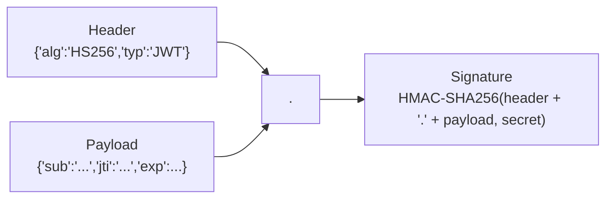

## What we're building

`jwt.rs`, with a `Claims` struct (`sub` — the user id, `jti` — a unique token id, `exp` — expiry), and two functions: `issue(user_id, secret) -> anyhow::Result<(String, String)>`, which signs a new token for a user and returns both the token and its `jti`, and `verify(token, secret) -> anyhow::Result<Claims>`, which checks a token's signature and expiry and returns its claims.

`issue` is what `register` and `login` call once a user's identity is confirmed. `verify` is what the `AuthUser` extractor in the next lesson calls on every request to a protected route.

## Why

TaskFlow's REST API is stateless in the classic sense — the server keeps no in-memory session per client — so every request has to prove who's making it using only what's in that request. A **JWT (JSON Web Token)** is a compact, URL-safe string a client sends in an `Authorization: Bearer <token>` header that the server can cryptographically verify without a database round trip: the token itself carries the claim ("I am user X") and a signature proving TaskFlow's server issued it and nobody tampered with it in transit.

A JWT has three base64url-encoded parts separated by dots — `header.payload.signature`:



- **Header** — which algorithm signed it (`HS256` here — HMAC with SHA-256, using our shared `jwt_secret`).
- **Payload** — the `Claims` struct we define: `sub` (subject — the user's id), `jti` (JWT ID — a unique identifier for *this specific token*), and `exp` (expiry, as a Unix timestamp). The payload is **base64-encoded, not encrypted** — anyone can decode and read it, they just can't forge a valid signature for a modified version without the secret.
- **Signature** — `jsonwebtoken::encode` HMACs the header and payload together using `jwt_secret`; `jsonwebtoken::decode` recomputes that HMAC and compares it, which is what makes tampering with `sub` or `exp` detectable — change one bit of the payload and the signature no longer matches.

## Pros & cons

**JWTs (what we're using) vs. server-side sessions (a session ID in a cookie, session data in Redis/Postgres)**

- Pros: no database or Redis lookup is required just to know *who* is making a request and that the token hasn't expired — `verify` is pure computation, a signature check plus a timestamp comparison. That scales horizontally with zero shared state between API instances: any instance holding `jwt_secret` can verify any token, no sticky sessions or shared session store required.
- Cons: that same statelessness is exactly what makes revocation hard — once a JWT is issued, it's cryptographically valid until `exp`, and there is no built-in way to say "actually, invalidate *this* one token right now." A session ID has the opposite trade-off: revoking it is a single `DELETE`, because the server was the source of truth for validity all along, not the token itself.

**Why we ALSO keep a Redis allowlist (`auth:token:{jti}`) on top of JWTs**

This is the resolution to the con above, and it's the reason `Claims` has a `jti` field at all. A bare JWT can't be revoked — logging out, or an admin banning a compromised account, has no effect on a token that's already been handed out; it stays valid until `exp` (24 hours, in our case) no matter what. Storing `auth:token:{jti} = user_id` in Redis with the *same* TTL as the token, and having every protected route check that the key still exists (next lesson), gives us an explicit, checkable "is this specific token still allowed" signal without abandoning JWTs' central benefit — the signature check that needs no I/O still happens first, and only a valid, non-expired token even gets to the Redis check. `logout` becomes a single Redis `DEL` on that one `jti`, exactly as cheap as revoking a session ID, while every other request still verifies the signature with zero database or Redis involvement if the allowlist check itself is what fails open... except it doesn't fail open: a missing key means "not authorized," full stop. We accept one Redis round trip per authenticated request as the cost of making logout actually work — pure stateless JWTs alone cannot do this.

**`exp` set to 24 hours, no refresh tokens (what we're using) vs. short-lived access token + long-lived refresh token**

- Pros: one token type, one code path, no refresh endpoint to build, no decision about where to store a refresh token safely. For a course-sized project this is the right amount of complexity.
- Cons: a stolen token is valid for up to 24 hours with no way to shorten that window short of revoking it via the Redis allowlist (which requires noticing the compromise first). A production system handling sensitive data would likely use a short-lived (minutes) access token plus a longer-lived, single-use refresh token — a pattern worth knowing about even though we don't build it here.

## Build it

### 1. Add the `jsonwebtoken` dependency

```bash
cd taskflow/backend
cargo add jsonwebtoken -p api
```

This adds `jsonwebtoken = "9"` under `[dependencies]` in `api/Cargo.toml`.

### 2. `jwt.rs`

Create `taskflow/backend/api/src/auth/jwt.rs`:

```rust
use chrono::{Duration, Utc};
use jsonwebtoken::{decode, encode, DecodingKey, EncodingKey, Header, Validation};
use serde::{Deserialize, Serialize};
use uuid::Uuid;

#[derive(Debug, Serialize, Deserialize)]
pub struct Claims {
    pub sub: String,
    pub jti: String,
    pub exp: usize,
}

pub fn issue(user_id: Uuid, secret: &str) -> anyhow::Result<(String, String)> {
    let jti = Uuid::new_v4().to_string();
    let exp = (Utc::now() + Duration::hours(24)).timestamp() as usize;

    let claims = Claims {
        sub: user_id.to_string(),
        jti: jti.clone(),
        exp,
    };

    let token = encode(
        &Header::default(),
        &claims,
        &EncodingKey::from_secret(secret.as_bytes()),
    )?;

    Ok((token, jti))
}

pub fn verify(token: &str, secret: &str) -> anyhow::Result<Claims> {
    let data = decode::<Claims>(
        token,
        &DecodingKey::from_secret(secret.as_bytes()),
        &Validation::default(),
    )?;

    Ok(data.claims)
}

#[cfg(test)]
mod tests {
    use super::*;

    #[test]
    fn issue_then_verify_round_trip() {
        let user_id = Uuid::new_v4();
        let (token, jti) = issue(user_id, "test-secret").unwrap();

        let claims = verify(&token, "test-secret").unwrap();

        assert_eq!(claims.sub, user_id.to_string());
        assert_eq!(claims.jti, jti);
    }

    #[test]
    fn rejects_the_wrong_secret() {
        let (token, _jti) = issue(Uuid::new_v4(), "test-secret").unwrap();
        assert!(verify(&token, "a-different-secret").is_err());
    }
}
```

A few details worth calling out:

- `Header::default()` picks `HS256` — HMAC-SHA256 — which is exactly right for a single-server-secret setup like ours; asymmetric algorithms (`RS256`, `ES256`) only pay off when a *different* service needs to verify tokens without holding the secret that signs them.
- `Validation::default()` validates `exp` automatically — `decode` returns an `Err` for an expired token before `verify` even gets to look at `claims.exp` itself, so an expired token can never reach `AuthUser` as if it were valid.
- `jti: Uuid::new_v4().to_string()` is generated fresh on every `issue` call — even the same user logging in twice gets two distinct `jti`s, so revoking one session (one browser, one device) doesn't touch the other.
- Both functions return `anyhow::Result<...>`, matching `password.rs`'s pattern — `jsonwebtoken`'s `Error` type implements `std::error::Error`, so `?` converts it via `anyhow`'s blanket `From` impl with no manual mapping needed, unlike `argon2`'s error type in the previous lesson.

### 3. Add `jwt` to the `auth` module

Update `taskflow/backend/api/src/auth/mod.rs`:

```rust
pub mod jwt;
pub mod password;
```

## Verify

```bash
cargo check -p api
```

Then run the new unit tests:

```bash
cargo test -p api auth::jwt
```

Expected output:

```
running 2 tests
test auth::jwt::tests::rejects_the_wrong_secret ... ok
test auth::jwt::tests::issue_then_verify_round_trip ... ok

test result: ok. 2 passed; 0 failed; 0 ignored; 0 measured; 0 filtered out
```

As with `password.rs`, expect `dead_code` warnings from `cargo check -p api` — `issue` and `verify` aren't called from a handler or extractor until [middleware](/taskflow/en/auth/middleware/) and [handlers](/taskflow/en/auth/handlers/).

## Recap

You built `issue` and `verify` in `jwt.rs`, signing and checking `HS256` JWTs whose payload is `{ sub, jti, exp }`. You saw why JWTs beat server-side sessions for stateless verification, and why that same statelessness is exactly what makes revocation hard — which is why every token's `jti` is about to become a key in a Redis allowlist. Next, we build the `AuthUser` extractor that runs `verify` and checks that allowlist on every protected request in [middleware](/taskflow/en/auth/middleware/).
