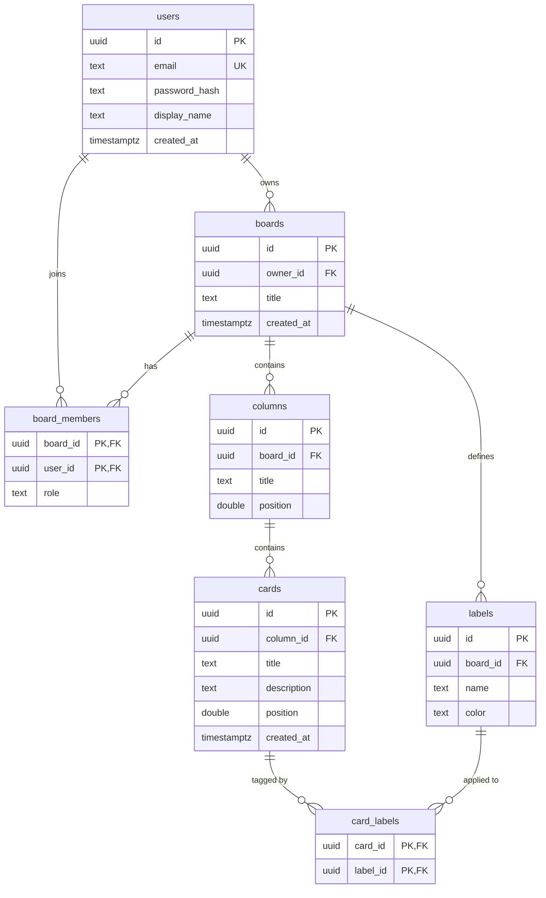

## What we're building

Before we write a single line of SQL, we design the shape of the data. TaskFlow is a realtime Kanban board, so the data model has to capture users, the boards they own, who else can see each board, the columns on a board, the cards inside those columns, and the labels used to tag cards.

That's seven tables. Here is the whole model at a glance:

This diagram is the single source of truth for the rest of the course. Every later module — migrations, the REST API, authentication, the realtime layer, and the frontend — refers back to these exact tables and columns. Get this right and the rest of the project has firm ground to stand on.

## Why

A schema is a set of promises. It says *these are the entities that exist, these are the fields each one carries, and these are the rules that keep the data honest.* A good schema pushes as many correctness guarantees as possible down into the database, where they hold no matter which piece of application code does the writing.

TaskFlow's model is a classic hierarchy with two many-to-many join tables:

- A **user** owns many **boards** (one-to-many).
- A **board** has many **members** through the `board_members` join table (many-to-many between users and boards).
- A **board** has many **columns**, a **column** has many **cards** — the core Kanban hierarchy.
- A **board** defines many **labels**, and a **card** can carry many labels through the `card_labels` join table (many-to-many between cards and labels).

Two design decisions cut across every table: we use **UUID primary keys** instead of auto-incrementing integers, and we lean on **foreign keys with `ON DELETE CASCADE`** so that deleting a parent row cleanly removes everything that hangs off it. Both are explained in full below.

## Pros & cons

**UUID primary keys (what we're using)**

- Pros: globally unique, so IDs can be generated on the client, in the API, or in the database without coordination; no cross-table collisions; they don't leak business information (an integer `id` of `4207` quietly tells the world how many rows you have, and lets anyone guess `/boards/4208`); merging data from multiple sources or sharding later is painless because IDs never clash.
- Cons: 16 bytes instead of 4 or 8, so indexes are larger; random UUIDs scatter inserts across the B-tree instead of appending at the end, which can hurt write locality; they're not human-friendly to read or type in a debugging session.

**`bigserial` / auto-increment integers (the alternative)**

- Pros: compact (8 bytes), monotonically increasing so inserts append to the end of the index (great write locality), and easy to eyeball.
- Cons: values are guessable and enumerable (an information-disclosure and IDOR risk on a public API), they require a round-trip or a sequence to generate, and they collide the moment you try to merge two databases or shard.

For a realtime collaborative app where the client often wants to create a card and know its ID immediately — before the server round-trip completes — UUIDs are the better fit. We accept the slightly larger index for the operational freedom.

**Foreign keys with `ON DELETE CASCADE`**

- Pros: the database enforces referential integrity — you physically cannot insert a card that points at a non-existent column — and cascading deletes keep the data tidy without a pile of manual cleanup queries.
- Cons: a cascade can delete far more than you expected if you're not careful (deleting one board wipes all its columns, cards, and labels), and foreign key checks add a small cost to writes. Those trade-offs are exactly what we want here: a deleted board *should* take its contents with it.

## Build it

"Building" the schema at this stage means designing it precisely — pinning down every table and every column's purpose. The next lesson turns this design into a real migration file. Here is each table, column by column.

### `users`

The account table. One row per person who can log in.

- `id uuid` — primary key, defaults to `gen_random_uuid()`.
- `email text` — the login identifier; `unique` and `not null`, so no two accounts can share an email.
- `password_hash text` — the Argon2/bcrypt hash of the password, never the plaintext. Set in the Authentication module.
- `display_name text` — the human-readable name shown on cards and member lists.
- `created_at timestamptz` — when the account was created; defaults to `now()`.

### `boards`

A Kanban board. The top of the content hierarchy.

- `id uuid` — primary key.
- `owner_id uuid` — foreign key to `users(id)` with `on delete cascade`; the user who created the board. Delete the user and their owned boards go with them.
- `title text` — the board's name.
- `created_at timestamptz` — creation time, defaults to `now()`.

### `board_members`

The many-to-many join between users and boards — who is allowed to see and edit a board. This is what the Authentication and REST modules check on every request.

- `board_id uuid` — foreign key to `boards(id)`, `on delete cascade`.
- `user_id uuid` — foreign key to `users(id)`, `on delete cascade`.
- `role text` — the member's role on this board (`'member'` by default; you might add `'admin'` later), `not null`.
- **Primary key** is the composite `(board_id, user_id)`, which guarantees a user appears at most once per board.

### `columns`

A vertical lane on a board — "To Do", "In Progress", "Done".

- `id uuid` — primary key.
- `board_id uuid` — foreign key to `boards(id)`, `on delete cascade`.
- `title text` — the column heading.
- `position double precision` — the ordering key that decides left-to-right column order. The fractional-ordering strategy is the whole subject of the [indexes & ordering](/taskflow/en/database/indexes-ordering/) lesson.

### `cards`

A task card living inside a column. The unit users drag around.

- `id uuid` — primary key.
- `column_id uuid` — foreign key to `columns(id)`, `on delete cascade`.
- `title text` — the card's title.
- `description text` — optional longer body (nullable — a card can exist with just a title).
- `position double precision` — the ordering key for top-to-bottom order within a column.
- `created_at timestamptz` — creation time, defaults to `now()`.

### `labels`

A colored tag defined on a board and reusable across its cards.

- `id uuid` — primary key.
- `board_id uuid` — foreign key to `boards(id)`, `on delete cascade`. Labels belong to a board, not globally.
- `name text` — the label text ("Bug", "Urgent").
- `color text` — a color value, typically a hex string like `#e11d48`.

### `card_labels`

The many-to-many join between cards and labels — which labels are stuck on which card.

- `card_id uuid` — foreign key to `cards(id)`, `on delete cascade`.
- `label_id uuid` — foreign key to `labels(id)`, `on delete cascade`.
- **Primary key** is the composite `(card_id, label_id)`, so the same label can't be applied to the same card twice.

### The cascade chain

Notice how the foreign keys form a chain: `users → boards → columns → cards`, plus the side branches `boards → labels` and the two join tables. Because every one of those foreign keys uses `on delete cascade`, deleting a single board triggers a clean sweep:

- its `columns` are deleted, which in turn delete their `cards`, which in turn delete the matching `card_labels` rows;
- its `labels` are deleted, which also clear their `card_labels` rows;
- its `board_members` rows are deleted.

One `DELETE FROM boards WHERE id = ...` leaves no orphaned rows anywhere. That is the payoff of enforcing relationships in the database instead of hoping the application remembers to clean up.

## Verify

There's no code to run yet — this is a design lesson — but you can sanity-check the model against these questions before moving on:

- Can a card ever point at a column that doesn't exist? No — the `column_id` foreign key forbids it.
- Can the same user be added to one board twice? No — the composite primary key `(board_id, user_id)` prevents it.
- If a user deletes their account, what happens to boards they own? They cascade-delete, taking their columns, cards, labels, and memberships with them.
- Where does a card's position in a column come from? The `position double precision` column, covered in the ordering lesson.

If those four answers match the diagram above, the design is sound and ready to become a migration.

## Recap

You designed the full TaskFlow data model: seven tables — `users`, `boards`, `board_members`, `columns`, `cards`, `labels`, `card_labels` — with a clear ownership hierarchy and two many-to-many join tables. You saw why UUID primary keys beat auto-increment integers for a client-driven realtime app, how foreign keys enforce referential integrity, and how `ON DELETE CASCADE` lets a single board deletion cleanly remove everything beneath it. Next, we turn this design into a real, versioned migration with [`sqlx-cli`](/taskflow/en/database/migrations/).
