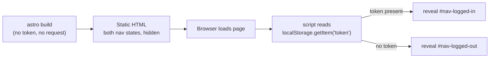

## What we're building

`Base.astro` under `frontend/src/layouts/` — the layout every page in this module wraps itself in. It's an HTML shell (`<html>`, `<head>`, `<body>`), a `<slot />` for page content, a nav bar with two states — "Log in" / "Register" when no token is stored, "Boards" / "Log out" when one is — and `frontend/src/styles/global.css`, a small global stylesheet imported once, here.

`frontend/astro.config.mjs` already has the `@astrojs/preact` integration wired in from Module 1, but nothing in this lesson touches Preact — `Base.astro`, and every page it wraps in this module, is plain Astro plus one inline `<script>`. The reactive, drag-and-drop Kanban board is a genuinely different problem, and it gets a genuinely different tool: Module 9, The Kanban Island.

## Why

TaskFlow's frontend is a static site (`output: 'static'` in `astro.config.mjs`) — there's no server rendering a page per request that could check "does this visitor have a token" and pick a nav bar accordingly. The token lives in the browser's `localStorage`, which the server that builds the static HTML never sees. So `Base.astro` renders *both* nav states into the HTML, hidden by default, and a small client `<script>` decides which one to reveal the instant the page loads:



This isn't a hydration mismatch in the React/Preact sense — there's no framework re-rendering a component tree on the client that has to agree with what the server produced. It's plain HTML with a `hidden` attribute and a script that removes it, so there's nothing to "mismatch" against.

## Pros & cons

**A plain Astro shell + one inline `<script>` (what we're using, this lesson through boards-list) vs. wrapping the whole page in a Preact/React "app shell" island**

- Pros: pages that don't need more than a nav toggle, a form, and a rendered list ship zero framework runtime — the browser parses plain HTML and one small bundled script, nothing else. First render is exactly what `astro build` produced; there's no JS bundle to download and execute before the login form or the board list becomes visible. No hydration directive to choose, no component tree, no framework state — `document.getElementById` and a couple of event listeners are the entire runtime cost.
- Cons: the nav toggle, and every page in this module, hand-writes imperative DOM updates — `element.hidden = false`, `document.createElement('li')` — instead of declarative state (`{loggedIn ? <LoggedInNav /> : <LoggedOutNav />}`). That's fine for a two-state nav bar or a list that only ever grows by one item at a time (append-only, as boards-list builds it), and it gets unmanageable fast the moment a UI needs to track many pieces of state that all affect each other — exactly what the actual Kanban board needs: which card is being dragged, which column it's hovering over, an optimistic reorder that has to roll back if the server rejects it, and remote updates arriving over WebSocket at any moment. That's the line Module 9 crosses with a Preact island; nothing in this module gets close to it.

## Build it

### 1. `frontend/src/styles/global.css`

```css
:root {
  color-scheme: light dark;
  font-family: system-ui, sans-serif;
}

* {
  box-sizing: border-box;
}

body {
  margin: 0;
  min-height: 100vh;
  display: flex;
  flex-direction: column;
}

.site-header {
  display: flex;
  align-items: center;
  justify-content: space-between;
  padding: 1rem 1.5rem;
  border-bottom: 1px solid #33333322;
}

.brand {
  font-weight: 700;
  text-decoration: none;
  color: inherit;
}

.nav-group {
  display: flex;
  gap: 1rem;
  align-items: center;
}

.nav-group[hidden] {
  display: none;
}

main {
  flex: 1;
  padding: 1.5rem;
  max-width: 720px;
  margin: 0 auto;
  width: 100%;
}

button {
  font: inherit;
  cursor: pointer;
}
```

`.nav-group[hidden] { display: none; }` is the one rule worth pausing on: without it, `.nav-group { display: flex; }` above would win the cascade over the browser's default `[hidden] { display: none; }` — both rules have the same specificity (one class or attribute selector each), and an author stylesheet always beats the user-agent stylesheet at equal specificity. The compound selector `.nav-group[hidden]` has higher specificity than `.nav-group` alone, so it wins instead, and `hidden` actually hides the element.

### 2. `frontend/src/layouts/Base.astro`

```astro
---
import '../styles/global.css';

export interface Props {
  title: string;
}

const { title } = Astro.props;
---
<html lang="en">
  <head>
    <meta charset="UTF-8" />
    <meta name="viewport" content="width=device-width, initial-scale=1.0" />
    <title>{title} · TaskFlow</title>
  </head>
  <body>
    <header class="site-header">
      <a class="brand" href="/">TaskFlow</a>
      <nav>
        <div id="nav-logged-out" class="nav-group" hidden>
          <a href="/login">Log in</a>
          <a href="/register">Register</a>
        </div>
        <div id="nav-logged-in" class="nav-group" hidden>
          <a href="/">Boards</a>
          <button id="logout-button" type="button">Log out</button>
        </div>
      </nav>
    </header>
    <main>
      <slot />
    </main>
  </body>
</html>

<script>
  const token = localStorage.getItem('token');
  const loggedOut = document.getElementById('nav-logged-out');
  const loggedIn = document.getElementById('nav-logged-in');

  if (token) {
    loggedIn?.removeAttribute('hidden');
  } else {
    loggedOut?.removeAttribute('hidden');
  }

  document.getElementById('logout-button')?.addEventListener('click', () => {
    localStorage.removeItem('token');
    window.location.href = '/login';
  });
</script>
```

`import '../styles/global.css';` in the frontmatter, not a raw `<link rel="stylesheet">` pointing at a path under `/src/` — `src/styles/global.css` isn't served as-is the way files under `public/` are, so it has to go through Vite's asset pipeline. Astro's frontmatter `import` of a `.css` file does exactly that: Vite bundles it and injects the resulting `<link>` tag automatically, with no manual path to keep in sync.

`localStorage.getItem('token')` here is a raw browser API call, not a call into `getToken()` — api-client, two lessons from now, is where `frontend/src/lib/api.ts` and its typed `getToken`/`setToken`/`clearToken` helpers get built. `Base.astro`'s nav script only needs a yes/no presence check, so reaching for the raw API here avoids a forward reference to a file this lesson doesn't build; pages that actually need to *call* the backend (starting with auth-pages, next) use the typed helpers instead.

The `<script>` tag has no `src` and no other attributes — Astro processes tags like that by default: bundled through Vite, TypeScript-checked, deduplicated if the same layout is used on multiple pages in one build. That's what makes writing plain `.ts`-flavored code directly inside a `.astro` file's `<script>` block work at all, no separate build step to wire up.

## Verify

```bash
cd frontend
npx astro check
```

This type-checks `Base.astro` — its `Props` interface, the `Astro.props` destructure, and the nav script — but doesn't render anything yet, since no page in this project imports `Base` until the next lesson. Once auth-pages builds `login.astro`, run `npm run dev`, open the page, and confirm the nav bar shows "Log in / Register." Then, in the browser devtools console, run `localStorage.setItem('token', 'x')` and reload — the nav should flip to "Boards / Log out" without any other code changing.

## Recap

You built `Base.astro` — an HTML shell with a `<slot />`, a two-state nav bar that a client script toggles based on whether `localStorage` has a token, and a globally imported stylesheet. You saw why the toggle has to happen client-side on a static site, and why this module's pages stay plain Astro plus vanilla script instead of reaching for a Preact island — a trade-off that holds right up until Module 9's actual Kanban board needs real, interlocking client state. Next, [auth-pages](/taskflow/en/frontend/auth-pages/) builds `login.astro` and `register.astro`, the first pages to wrap themselves in `Base` and the first to call the backend.
