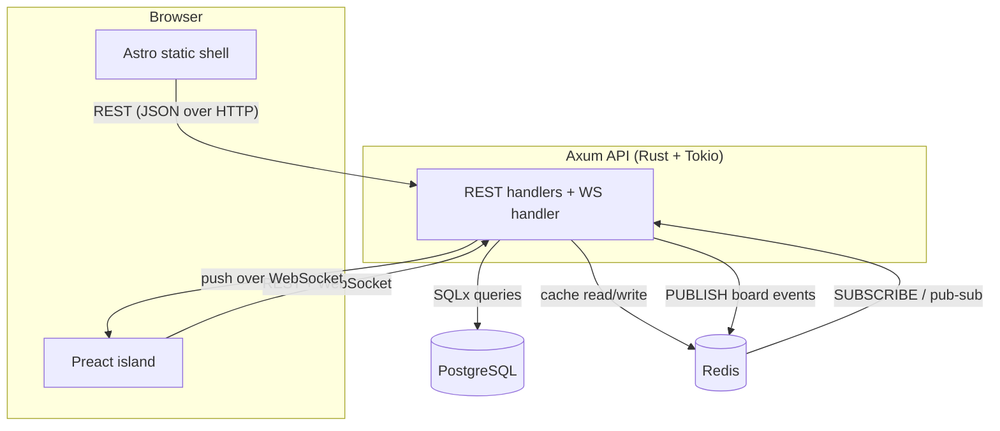

## What we're building

Before we write a line of code, let's map the whole system on one page. TaskFlow has four moving parts — a browser frontend, an Axum API, PostgreSQL, and Redis — and two important paths through them: the ordinary **request path** (you ask for data or make a change) and the **realtime path** (a change made by anyone shows up live for everyone).

Here's the shape of it:

## Why

Splitting the system this way keeps each concern in the tool that's best at it: PostgreSQL owns the durable truth, Redis owns speed and fan-out, Axum owns business logic, and Astro owns the UI. Understanding the two paths below is the mental model you'll carry through every later module.

### The request path

This is the classic flow — read a board, move a card, create a column:

1. The **browser** sends an HTTP request to the **Axum API** (e.g. `GET /boards/:id` or `PATCH /cards/:id`). The Preact island and the static shell both talk to the same REST endpoints.
2. Axum authenticates the request (JWT), then runs its handler.
3. For a read, it first checks **Redis** for a cached copy. On a hit, it returns immediately. On a miss, it queries **PostgreSQL** with SQLx, stores the result in Redis, and returns it.
4. For a write, it updates **PostgreSQL** (the source of truth), invalidates the relevant Redis cache entry, and — importantly — **publishes an event** to Redis describing what changed.

### The realtime path

This is what makes the board feel alive:

1. When a client opens a board, its island opens a **WebSocket** connection to Axum and effectively "joins the room" for that board.
2. When any write happens (step 4 above), Axum **PUBLISHes** an event to a Redis pub/sub channel for that board.
3. Every Axum instance **SUBSCRIBEs** to those channels. Redis fans the event out to all of them.
4. Each Axum instance pushes the event down every open **WebSocket** for that board.
5. The islands receive the event and update the UI — the card glides across the columns on every teammate's screen.

Why route events through Redis instead of straight from handler to WebSocket? Because in production you run **more than one** Axum instance behind a load balancer. A card moved on instance A must reach a teammate connected to instance B. Redis pub/sub is the **backplane** that connects them. It works with a single instance too, so we build it right from the start.

## Pros & cons

TaskFlow's stack is a set of deliberate trade-offs. Here's an honest look at each major choice.

### Rust + Axum (vs Node.js)

- **Pros:** Compile-time safety catches whole classes of bugs; excellent performance and low, predictable memory use; fearless concurrency via Tokio makes the WebSocket fan-out robust; a single static binary is trivial to containerize.
- **Cons:** Steeper learning curve and slower to write than Node; smaller ecosystem for some niche libraries; compile times are longer than a scripting language's edit-refresh loop.
- **Why we chose it:** A realtime server juggling many concurrent connections is exactly where Rust's safety and concurrency shine, and it's the language the Learn Hub Rust course prepares you for.

### PostgreSQL (vs MongoDB)

- **Pros:** TaskFlow's data is deeply **relational** — users own boards, boards have columns, columns have cards; foreign keys and transactions keep it consistent; ordering cards is a natural fit for SQL; SQLx gives us compile-time-checked queries.
- **Cons:** You must design a schema up front and write migrations; less forgiving of shape changes than a document store.
- **Why we chose it:** The relationships are the product. A document database would push that integrity into application code we'd rather not maintain.

### Redis — its three roles here

Redis pulls triple duty in TaskFlow, which is why it earns its place:

1. **Session / token store** — JWT refresh tokens and session state live here, so we can revoke them and keep auth stateless-but-revocable.
2. **Read cache** — hot board reads are served from Redis to keep PostgreSQL from doing the same query over and over.
3. **Pub/sub backplane** — the realtime events that fan out to every WebSocket, as described above.

- **Pros:** One dependency covers three needs; blazing fast; pub/sub is simple and battle-tested.
- **Cons:** In-memory means cached/session data is volatile unless configured for persistence; it's another service to run and reason about.
- **Why we chose it:** Each of the three roles alone might justify Redis; together they make it the backbone of the fast, live experience.

### Astro islands (vs a full SPA)

- **Pros:** The board page ships as mostly static HTML — fast first paint, great SEO, tiny JS payload; **only** the interactive Kanban board hydrates as a Preact island, so we pay for interactivity exactly where we need it.
- **Cons:** You think in terms of "what's static vs. what's an island," which is a different model than an all-JS SPA; sharing state across many islands can get awkward (we deliberately use just one).
- **Why we chose it:** A Kanban app is one small interactive surface on an otherwise static page — the island model fits it perfectly and keeps the frontend lean.

### WebSocket (vs SSE / polling)

- **Pros:** True **bidirectional**, low-latency channel; the client can send and the server can push over one connection; ideal for "everyone sees the move instantly."
- **Cons:** Stateful connections are more complex to scale than plain HTTP (hence the Redis backplane); need to handle reconnects and dropped connections.
- **Why we chose it:** Polling wastes requests and adds lag; SSE is one-directional (server→client only). A Kanban board where clients both send moves and receive them wants a full duplex channel — WebSocket.

## Verify

Check your understanding:

- Can you trace a **card move** from the browser all the way to a teammate's screen, naming every hop?
- Why does a realtime event go through Redis pub/sub instead of directly from the handler to the socket?
- Which of Redis's three roles would you lose first if you dropped it, and what would break?

## Recap

TaskFlow is four parts — browser, Axum API, PostgreSQL, Redis — wired along two paths. The **request path** reads and writes data (with Redis caching in front of PostgreSQL); the **realtime path** publishes every change to Redis pub/sub, which fans it out to every Axum instance and down every WebSocket. Each stack choice — Rust/Axum, PostgreSQL, Redis's three roles, Astro islands, WebSocket — is a deliberate trade-off you can now defend. Next, we'll get your machine set up in [prerequisites](/taskflow/en/introduction/prerequisites/).
