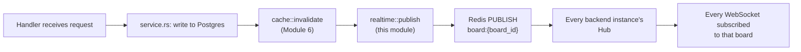

## What we're building

No code yet — this lesson is the map for the three lessons that follow it, the same role [design](/taskflow/en/rest-api/design/) played for the REST API module. TaskFlow's realtime layer has exactly one job: when a card moves, a column gets renamed, or a card is created or deleted, every browser tab with that board open — not just the tab that made the change — sees it happen, without anyone hitting refresh.

One envelope, `BoardEvent`, carries every kind of update:

```rust
#[derive(serde::Serialize, serde::Deserialize)]
pub struct BoardEvent {
    pub r#type: String,
    #[serde(rename = "boardId")]
    pub board_id: Uuid,
    pub payload: serde_json::Value,
}
```

And a fixed catalog of `type` strings names every kind of change this module broadcasts:

| `type` | Fires when | `payload` shape |
|---|---|---|
| `card.created` | A card is created in a column | `{ "columnId": Uuid, "card": Card }` |
| `card.updated` | A card's title/description changes | `{ "card": Card }` |
| `card.moved` | A card changes column and/or position | `{ "card": Card }` |
| `card.deleted` | A card is deleted | `{ "cardId": Uuid, "columnId": Uuid }` |
| `column.created` | A column is created on a board | `{ "column": Column }` |
| `column.updated` | A column's title changes | `{ "column": Column }` |
| `column.deleted` | A column is deleted | `{ "columnId": Uuid }` |

`BoardEvent`, as a Rust struct, becomes real code in [ws-endpoint](/taskflow/en/realtime/ws-endpoint/) — this lesson defines its shape once so the next three lessons can build against it without re-deriving it.

## Why

Every event in the catalog above corresponds to exactly one existing mutation from [REST API](/taskflow/en/rest-api/design/) — the same ten-ish functions [invalidation](/taskflow/en/caching/invalidation/) already taught to call `cache::invalidate` right after their write. Realtime adds one more call, right next to that one, at the exact same spot in the exact same functions:



`r#type` (the raw identifier, `type` being a Rust keyword) and `board_id` are the routing information — which board this event belongs to, and what kind of thing happened. `payload` is deliberately `serde_json::Value` rather than a typed enum of payload structs: every event type's payload is a different shape (a full `Card`, a full `Column`, or just a bare id), and a client-side JavaScript listener is going to `JSON.parse` the whole envelope and branch on `type` regardless of how strongly the server's own internal representation is typed. A generic `Value` here costs nothing on the Rust side (`serde_json::to_value` handles any `Serialize` type uniformly) and matches exactly what actually crosses the wire.

Why a **broadcast-on-mutation** model — the server pushes an event the instant something changes — rather than a client that has to ask "did anything change?" is the first thing worth deciding, before any code exists to argue about. The next lessons build the mechanism; this lesson decides why that mechanism is a WebSocket carrying push-only server-to-client events, not a polling loop.

## Pros & cons

**WebSocket (what we're using) vs. Server-Sent Events (SSE) vs. long-polling**

- Pros: a WebSocket is a single, persistent, full-duplex TCP connection — the server pushes an event the instant it happens, with no polling interval to tune and no per-message HTTP overhead (headers, TLS handshake reuse aside) the way a new request would carry. It's also the natural fit for a *later* feature this course doesn't build but a real Kanban tool eventually would — cursor/presence broadcasting ("Ada is viewing this board") — which needs the client to send messages too, something SSE fundamentally can't do (it's server-to-client only) and long-polling can only fake by pairing it with separate outbound requests.
- Cons: SSE (`text/event-stream` over plain HTTP) would have been simpler for TaskFlow's actual current need — it's just an HTTP response that never ends, works over the same `fetch`-friendly infrastructure as everything else, auto-reconnects with `EventSource` with zero client code, and needs no separate upgrade handshake or `tokio::select!` loop server-side. Long-polling (a client `GET`s and the server holds the connection open until there's something to say, or a timeout) is the least infrastructure-dependent option — no special protocol support required anywhere in the request path — but it fakes "push" out of "pull," reintroducing per-event request overhead and latency roughly equal to however long a single poll cycle takes to notice. TaskFlow picks WebSocket because it maps directly onto the [WebSocket Design](https://en.wikipedia.org/wiki/WebSocket) concepts this course's sibling material assumes, and because it's the one option of the three that doesn't foreclose bidirectional features later — the cost is exactly the extra ceremony this module spends four lessons on: an upgrade handshake, a per-socket task, and (starting in [redis-backplane](/taskflow/en/realtime/redis-backplane/)) a way to fan a single event out across more than one backend process.

**Broadcast-on-mutation (what we're using) vs. the client polling `GET /boards/:id` on an interval**

- Pros: an event arrives the instant [invalidation](/taskflow/en/caching/invalidation/)'s cache-clearing write commits — there's no "how often should the client poll" tuning knob to get wrong (too frequent wastes requests on boards nobody's editing; too infrequent means real staleness). It also composes with everything already built: the same `board_id` [caching](/taskflow/en/caching/cache-reads/) uses as its cache key namespace is the same `board_id` this module uses as its pub/sub channel name and its `BoardEvent.board_id` field — one identifier, three related-but-distinct uses, never confused because each lives in its own explicitly documented namespace.
- Cons: broadcast-on-mutation only tells a connected client *that* something changed and, for most event types, exactly *what* — but a client that was disconnected when an event fired never receives it; there's no replay log, no "catch me up from ten minutes ago." [reconnect](/taskflow/en/realtime/reconnect/) covers this gap directly: the mitigation isn't a more complex event-sourcing broadcast, it's a plain `GET /boards/:id` refetch the instant a socket reconnects, reusing the exact same cache-aside endpoint [caching](/taskflow/en/caching/cache-reads/) already built.

## Verify

There's no code to run yet — confirm your understanding instead:

- Which field in `BoardEvent` tells a client which board an event belongs to, and does it match the Redis pub/sub **channel** name or the Redis cache **key** name from [cache-reads](/taskflow/en/caching/cache-reads/)? (`board_id`, matching the channel name `board:{board_id}` — *not* the cache key `cache:board:{board_id}`, which is a different Redis namespace entirely.)
- Why is `payload` typed as `serde_json::Value` instead of a Rust enum with one variant per event type? (Every event type's payload is genuinely shaped differently — a full `Card`, a full `Column`, or just an id — and the client parses the same JSON either way; a generic `Value` matches the wire format without inventing a Rust-side type that has no reader on the other end of the socket.)
- Why does `card.deleted`'s payload carry `columnId` even though the card itself — and therefore its `column_id` — no longer exists in Postgres by the time the event is built? (The event is built from the row *just before* it's deleted, in the same service function that already looked the card up to authorize the delete — the data exists in memory for exactly long enough to describe what was removed.)

If those three answers make sense, [ws-endpoint](/taskflow/en/realtime/ws-endpoint/) starts turning this envelope into a real, running `GET /ws/boards/:id` route.

## Recap

You defined `BoardEvent` — `type`, `boardId`, `payload` — and its seven-entry event catalog, the single message shape every mutation in this module will broadcast. You compared WebSocket against SSE and long-polling and picked WebSocket for its push latency and bidirectional headroom, and you compared broadcast-on-mutation against client polling, naming the one real gap broadcast-on-mutation leaves open — a disconnected client misses events entirely — which [reconnect](/taskflow/en/realtime/reconnect/) closes with a refetch, not a replay log. Next, [ws-endpoint](/taskflow/en/realtime/ws-endpoint/) builds the actual `/ws/boards/:id` upgrade handler and the per-socket loop that delivers these events.
