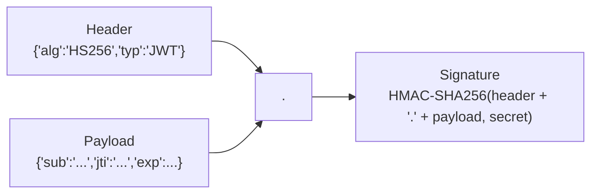

## What we're building

`jwt.rs` มี struct `Claims` (`sub` — user id, `jti` — unique token id, `exp` — วันหมดอายุ) และสองฟังก์ชัน: `issue(user_id, secret) -> anyhow::Result<(String, String)>` ที่เซ็น token ใหม่ให้ผู้ใช้และคืนทั้ง token กับ `jti` ของมัน และ `verify(token, secret) -> anyhow::Result<Claims>` ที่เช็ค signature และวันหมดอายุของ token แล้วคืน claims ของมัน

`issue` คือสิ่งที่ `register` และ `login` เรียกเมื่อยืนยันตัวตนของผู้ใช้ได้แล้ว `verify` คือสิ่งที่ extractor `AuthUser` ในบทเรียนถัดไปจะเรียกทุกครั้งที่มี request มาที่ route ที่ต้อง login

## Why

REST API ของ TaskFlow เป็น stateless ในความหมายดั้งเดิม — server ไม่เก็บ session ใน memory ต่อ client เลย — ดังนั้นทุก request ต้องพิสูจน์ตัวเองว่าใครเป็นคนส่งมา โดยใช้แค่สิ่งที่อยู่ใน request นั้นเอง **JWT (JSON Web Token)** คือ string ที่กะทัดรัดและใช้ใน URL ได้ ที่ client ส่งมาใน header `Authorization: Bearer <token>` ซึ่ง server สามารถ verify ด้วยวิธี cryptographic โดยไม่ต้องไปที่ฐานข้อมูล: ตัว token เองพก claim ("ฉันคือผู้ใช้ X") และ signature ที่พิสูจน์ว่า server ของ TaskFlow เป็นคนออก token นี้ และไม่มีใครแก้ไขมันระหว่างทาง

JWT มีสามส่วนที่เข้ารหัสแบบ base64url คั่นด้วยจุด — `header.payload.signature`:



- **Header** — algorithm ไหนเป็นคนเซ็น (`HS256` ในที่นี้ — HMAC ด้วย SHA-256 โดยใช้ `jwt_secret` ที่เราแชร์กัน)
- **Payload** — struct `Claims` ที่เรานิยาม: `sub` (subject — id ของผู้ใช้), `jti` (JWT ID — ตัวระบุที่ไม่ซ้ำกันของ *token ตัวนี้โดยเฉพาะ*) และ `exp` (วันหมดอายุ เป็น Unix timestamp) payload **ถูก base64-encode ไม่ใช่ encrypt** — ใครก็ decode และอ่านได้ แค่พวกเขาปลอม signature ที่ถูกต้องสำหรับเวอร์ชันที่ถูกแก้ไขไม่ได้ ถ้าไม่มี secret
- **Signature** — `jsonwebtoken::encode` ทำ HMAC กับ header และ payload รวมกันโดยใช้ `jwt_secret`; `jsonwebtoken::decode` คำนวณ HMAC นั้นใหม่แล้วเทียบกัน ซึ่งเป็นสิ่งที่ทำให้การแก้ไข `sub` หรือ `exp` ถูกจับได้ — เปลี่ยนแค่บิตเดียวใน payload แล้ว signature จะไม่ตรงกันอีกต่อไป

## Pros & cons

**JWT (ตัวที่เราใช้) เทียบกับ server-side session (session ID ใน cookie ข้อมูล session ใน Redis/Postgres)**

- ข้อดี: ไม่ต้องมีการ query ฐานข้อมูลหรือ Redis เลยแค่เพื่อรู้ว่า *ใคร* กำลังส่ง request มาและ token ยังไม่หมดอายุ — `verify` คือการคำนวณล้วน ๆ แค่เช็ค signature บวกเทียบ timestamp นี่ scale แบบ horizontal ได้โดยไม่มี shared state ระหว่าง instance ของ API เลย: instance ไหนก็ตามที่ถือ `jwt_secret` verify token ไหนก็ได้ ไม่ต้องมี sticky session หรือ shared session store
- ข้อเสีย: ความเป็น stateless แบบเดียวกันนี้เองที่ทำให้การ revoke ยาก — เมื่อ JWT ถูกออกไปแล้ว มันถูกต้องเชิง cryptographic จนถึง `exp` และไม่มีวิธีในตัวที่จะบอกว่า "จริง ๆ แล้ว invalidate token ตัวนี้เดี๋ยวนี้เลย" session ID มี trade-off ตรงข้ามกัน: การ revoke มันคือแค่ `DELETE` เดียว เพราะ server เป็นแหล่งความจริงของความถูกต้องมาตลอด ไม่ใช่ตัว token เอง

**ทำไมเราถึงเก็บ Redis allowlist (`auth:token:{jti}`) เพิ่มด้วย นอกเหนือจาก JWT**

นี่คือคำตอบของข้อเสียด้านบน และเป็นเหตุผลที่ `Claims` มี field `jti` ตั้งแต่แรก JWT เปล่า ๆ revoke ไม่ได้ — การ logout หรือ admin แบนบัญชีที่ถูก compromise ไม่มีผลอะไรกับ token ที่ถูกแจกไปแล้ว มันจะยังใช้ได้จนถึง `exp` (24 ชั่วโมง ในกรณีของเรา) ไม่ว่ายังไงก็ตาม การเก็บ `auth:token:{jti} = user_id` ใน Redis ด้วย TTL *เดียวกัน* กับ token และให้ทุก route ที่ต้อง login เช็คว่า key นั้นยังอยู่ (บทเรียนถัดไป) ให้เรามีสัญญาณที่ชัดเจนและเช็คได้ว่า "token ตัวนี้โดยเฉพาะยังใช้ได้อยู่ไหม" โดยไม่ทิ้งข้อดีหลักของ JWT — การเช็ค signature ที่ไม่ต้องมี I/O ยังคงเกิดขึ้นก่อนเสมอ และมีแค่ token ที่ valid และยังไม่หมดอายุเท่านั้นที่จะไปถึงขั้นการเช็ค Redis `logout` กลายเป็นแค่ Redis `DEL` เดียวบน `jti` ตัวนั้น ถูกเท่ากับการ revoke session ID เป๊ะ ในขณะที่ request ที่ผ่านการยืนยันตัวตนทุกตัวยัง verify signature โดยไม่ต้องพึ่งฐานข้อมูลหรือ Redis เลย... ยกเว้นว่ามันไม่ fail open: key ที่หายไปหมายถึง "ไม่ได้รับอนุญาต" จบ เรายอมรับ Redis round trip หนึ่งครั้งต่อ request ที่ยืนยันตัวตนแล้ว เป็นต้นทุนที่ทำให้ logout ทำงานได้จริง — JWT แบบ stateless ล้วน ๆ ทำสิ่งนี้เองไม่ได้

**`exp` ตั้งเป็น 24 ชั่วโมง ไม่มี refresh token (ตัวที่เราใช้) เทียบกับ access token อายุสั้น + refresh token อายุยาว**

- ข้อดี: token ประเภทเดียว code path เดียว ไม่ต้องสร้าง refresh endpoint ไม่ต้องตัดสินใจว่าจะเก็บ refresh token ไว้ที่ไหนอย่างปลอดภัย สำหรับโปรเจกต์ขนาดคอร์สแบบนี้ นี่คือความซับซ้อนที่พอดี
- ข้อเสีย: token ที่ถูกขโมยจะใช้ได้นานถึง 24 ชั่วโมง โดยไม่มีทางย่นระยะเวลานั้นได้เลยนอกจาก revoke ผ่าน Redis allowlist (ซึ่งต้องรู้ก่อนว่าถูก compromise) ระบบ production ที่จัดการข้อมูลอ่อนไหวน่าจะใช้ access token อายุสั้น (นาที) บวกกับ refresh token อายุยาวกว่าที่ใช้ได้ครั้งเดียว — pattern ที่ควรรู้ไว้แม้เราจะไม่ได้สร้างมันที่นี่

## Build it

### 1. เพิ่ม dependency `jsonwebtoken`

```bash
cd taskflow/backend
cargo add jsonwebtoken -p api
```

คำสั่งนี้เพิ่ม `jsonwebtoken = "9"` ใต้ `[dependencies]` ใน `api/Cargo.toml`

### 2. `jwt.rs`

สร้าง `taskflow/backend/api/src/auth/jwt.rs`:

```rust
use chrono::{Duration, Utc};
use jsonwebtoken::{decode, encode, DecodingKey, EncodingKey, Header, Validation};
use serde::{Deserialize, Serialize};
use uuid::Uuid;

#[derive(Debug, Serialize, Deserialize)]
pub struct Claims {
    pub sub: String,
    pub jti: String,
    pub exp: usize,
}

pub fn issue(user_id: Uuid, secret: &str) -> anyhow::Result<(String, String)> {
    let jti = Uuid::new_v4().to_string();
    let exp = (Utc::now() + Duration::hours(24)).timestamp() as usize;

    let claims = Claims {
        sub: user_id.to_string(),
        jti: jti.clone(),
        exp,
    };

    let token = encode(
        &Header::default(),
        &claims,
        &EncodingKey::from_secret(secret.as_bytes()),
    )?;

    Ok((token, jti))
}

pub fn verify(token: &str, secret: &str) -> anyhow::Result<Claims> {
    let data = decode::<Claims>(
        token,
        &DecodingKey::from_secret(secret.as_bytes()),
        &Validation::default(),
    )?;

    Ok(data.claims)
}

#[cfg(test)]
mod tests {
    use super::*;

    #[test]
    fn issue_then_verify_round_trip() {
        let user_id = Uuid::new_v4();
        let (token, jti) = issue(user_id, "test-secret").unwrap();

        let claims = verify(&token, "test-secret").unwrap();

        assert_eq!(claims.sub, user_id.to_string());
        assert_eq!(claims.jti, jti);
    }

    #[test]
    fn rejects_the_wrong_secret() {
        let (token, _jti) = issue(Uuid::new_v4(), "test-secret").unwrap();
        assert!(verify(&token, "a-different-secret").is_err());
    }
}
```

มีรายละเอียดสองสามอย่างที่ควรพูดถึง:

- `Header::default()` เลือก `HS256` — HMAC-SHA256 — ซึ่งเหมาะเป๊ะสำหรับ setup แบบ single-server-secret อย่างของเรา; algorithm แบบ asymmetric (`RS256`, `ES256`) จะคุ้มค่าก็ต่อเมื่อมีบริการ *อื่น* ที่ต้อง verify token โดยไม่ถือ secret ที่ใช้เซ็นมันด้วย
- `Validation::default()` verify `exp` ให้อัตโนมัติ — `decode` คืน `Err` สำหรับ token ที่หมดอายุก่อนที่ `verify` จะได้ดู `claims.exp` เองด้วยซ้ำ ดังนั้น token ที่หมดอายุจะไม่มีทางไปถึง `AuthUser` ราวกับว่ามันยัง valid อยู่ได้เลย
- `jti: Uuid::new_v4().to_string()` ถูกสร้างใหม่ทุกครั้งที่เรียก `issue` — แม้แต่ผู้ใช้คนเดียวกัน login สองครั้ง ก็ได้ `jti` สองตัวที่ต่างกัน ดังนั้นการ revoke session หนึ่ง (browser หนึ่ง, device หนึ่ง) จึงไม่กระทบอีกอันหนึ่ง
- ทั้งสองฟังก์ชันคืนค่า `anyhow::Result<...>` ตรงกับ pattern ของ `password.rs` — ประเภท `Error` ของ `jsonwebtoken` implement `std::error::Error` ดังนั้น `?` แปลงมันผ่าน blanket `From` impl ของ `anyhow` ได้โดยไม่ต้อง map เองเลย ต่างจากประเภท error ของ `argon2` ในบทเรียนก่อนหน้า

### 3. เพิ่ม `jwt` เข้า module `auth`

อัปเดต `taskflow/backend/api/src/auth/mod.rs`:

```rust
pub mod jwt;
pub mod password;
```

## Verify

```bash
cargo check -p api
```

จากนั้นรัน unit test ใหม่:

```bash
cargo test -p api auth::jwt
```

ผลลัพธ์ที่ควรได้:

```
running 2 tests
test auth::jwt::tests::rejects_the_wrong_secret ... ok
test auth::jwt::tests::issue_then_verify_round_trip ... ok

test result: ok. 2 passed; 0 failed; 0 ignored; 0 measured; 0 filtered out
```

เหมือนกับ `password.rs` คาดว่าจะเจอ warning ประเภท `dead_code` จาก `cargo check -p api` — `issue` และ `verify` ยังไม่ถูกเรียกจาก handler หรือ extractor ใดจนกว่าจะถึง [middleware](/taskflow/th/auth/middleware/) และ [handlers](/taskflow/th/auth/handlers/)

## Recap

คุณสร้าง `issue` และ `verify` ใน `jwt.rs` เซ็นและเช็ค JWT แบบ `HS256` ที่ payload เป็น `{ sub, jti, exp }` คุณเห็นแล้วว่าทำไม JWT ถึงชนะ server-side session ในเรื่องการ verify แบบ stateless และทำไมความ stateless แบบเดียวกันนั้นถึงทำให้การ revoke ยากพอดี — ซึ่งเป็นเหตุผลที่ `jti` ของทุก token กำลังจะกลายเป็น key ใน Redis allowlist ต่อไปเราจะสร้าง extractor `AuthUser` ที่รัน `verify` และเช็ค allowlist นั้นทุกครั้งที่มี request มาที่ route ที่ต้อง login ใน [middleware](/taskflow/th/auth/middleware/)
