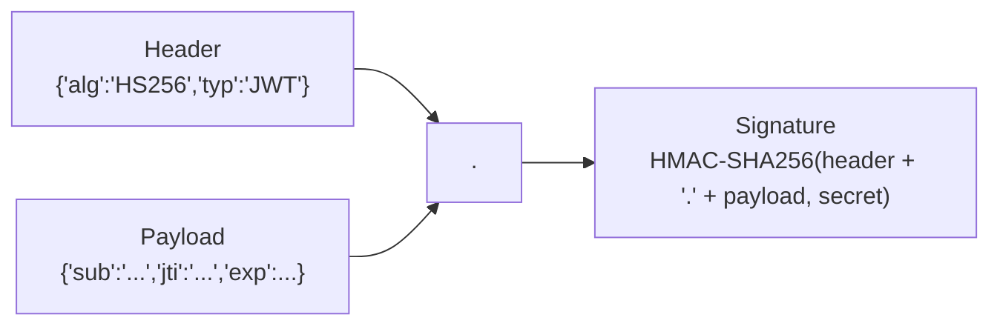

## สิ่งที่จะสร้าง

`jwt.rs` มี struct `Claims` (`sub` — user id, `jti` — unique token id, `exp` — วันหมดอายุ) และอีกสองฟังก์ชัน ตัวแรกคือ `issue(user_id, secret) -> anyhow::Result<(String, String)>` เซ็น token ใหม่ให้ผู้ใช้แล้วคืนทั้งตัว token และ `jti` ตัวที่สองคือ `verify(token, secret) -> anyhow::Result<Claims>` เช็ค signature กับวันหมดอายุของ token แล้วคืน claims ออกมา

`register` และ `login` จะเรียก `issue` หลังยืนยันตัวตนของผู้ใช้ผ่านแล้ว ส่วน `verify` นั้น extractor `AuthUser` ในบทเรียนถัดไปจะเรียกทุกครั้งที่มี request เข้ามาที่ route ที่ต้อง login

## ทำไม

REST API ของ TaskFlow เป็น stateless ในความหมายดั้งเดิม — server ไม่เก็บ session ใน memory ต่อ client เลย — ทุก request จึงต้องพิสูจน์ตัวเองว่าใครเป็นคนส่งมา โดยใช้แค่สิ่งที่ติดมากับ request นั้นเอง

**JWT (JSON Web Token)** คือ string ที่กะทัดรัดและใช้ใน URL ได้ ฝั่ง client ส่งมาใน header `Authorization: Bearer <token>` แล้ว server verify ด้วยวิธี cryptographic ได้เลยโดยไม่ต้องแตะฐานข้อมูล ตัว token พก claim ("ฉันคือผู้ใช้ X") มาเอง พร้อม signature ที่พิสูจน์ว่า server ของ TaskFlow เป็นคนออก token นี้ และไม่มีใครแก้ไขระหว่างทาง

JWT มีสามส่วนที่เข้ารหัสแบบ base64url คั่นด้วยจุด — `header.payload.signature`:


```mermaid
flowchart LR
    A["Header<br/>{'alg':'HS256','typ':'JWT'}"] --> D["."]
    B["Payload<br/>{'sub':'...','jti':'...','exp':...}"] --> D
    D --> C["Signature<br/>HMAC-SHA256(header + '.' + payload, secret)"]
```

- **Header** — algorithm ไหนเป็นคนเซ็น (`HS256` ในที่นี้ — HMAC ด้วย SHA-256 โดยใช้ `jwt_secret` ที่เราแชร์กัน)
- **Payload** — struct `Claims` ที่เรานิยาม: `sub` (subject — id ของผู้ใช้), `jti` (JWT ID — ตัวระบุที่ไม่ซ้ำของ *token ตัวนี้โดยเฉพาะ*) และ `exp` (วันหมดอายุ เป็น Unix timestamp) ส่วนนี้เป็นแค่ base64-encode **ไม่ได้ encrypt** ใครก็ decode ออกมาอ่านได้ เพียงแต่ถ้าไม่มี secret ก็ปลอม signature ให้ตรงกับ payload ที่แก้แล้วไม่ได้
- **Signature** — `jsonwebtoken::encode` ทำ HMAC กับ header และ payload รวมกันโดยใช้ `jwt_secret` ฝั่ง `jsonwebtoken::decode` คำนวณ HMAC นั้นใหม่แล้วเอามาเทียบ การแก้ `sub` หรือ `exp` จึงโดนจับได้ทันที เปลี่ยนแค่บิตเดียวใน payload แล้ว signature ก็ไม่ตรงอีกต่อไป

## ข้อดีข้อเสีย

**JWT (ตัวที่เราใช้) เทียบกับ server-side session (session ID ใน cookie ข้อมูล session ใน Redis/Postgres)**

- ข้อดี: ไม่ต้อง query ฐานข้อมูลหรือ Redis เลยแค่เพื่อรู้ว่า *ใคร* ส่ง request มาและ token ยังไม่หมดอายุ `verify` เป็นการคำนวณล้วน ๆ แค่เช็ค signature บวกเทียบ timestamp แบบนี้ scale แนวนอนได้โดยไม่ต้องมี shared state ระหว่าง instance ของ API เลย instance ไหนถือ `jwt_secret` ก็ verify token ได้ทุกใบ ไม่ต้องมี sticky session หรือ shared session store
- ข้อเสีย: ความ stateless แบบเดียวกันนี้เองที่ทำให้การ revoke ยาก พอออก JWT ไปแล้ว token ใบนั้นถูกต้องเชิง cryptographic ไปจนถึง `exp` และไม่มีกลไกในตัวที่จะบอกว่า "invalidate ใบนี้เดี๋ยวนี้เลย" ส่วน session ID มี trade-off ตรงข้ามกัน การ revoke คือ `DELETE` ครั้งเดียวจบ เพราะแหล่งความจริงของความถูกต้องอยู่ที่ server มาตลอด ไม่ใช่ที่ตัว token

**ทำไมเราถึงเก็บ Redis allowlist (`auth:token:{jti}`) เพิ่มด้วย นอกเหนือจาก JWT**

นี่คือคำตอบของข้อเสียด้านบน และเป็นเหตุผลที่ `Claims` มี field `jti` มาตั้งแต่แรก JWT เปล่า ๆ revoke ไม่ได้ — ผู้ใช้กด logout หรือ admin แบนบัญชีที่โดน compromise ก็ไม่มีผลอะไรกับ token ที่แจกออกไปแล้ว token ใบนั้นยังใช้ได้จนถึง `exp` (24 ชั่วโมง ในกรณีของเรา) อยู่ดี

ทางแก้คือเก็บ `auth:token:{jti} = user_id` ไว้ใน Redis ด้วย TTL *เดียวกัน* กับ token แล้วให้ทุก route ที่ต้อง login เช็คว่า key นั้นยังอยู่ไหม (บทเรียนถัดไป) เท่านี้เราก็มีสัญญาณที่ชัดเจนและเช็คได้ว่า "token ใบนี้ยังใช้ได้อยู่ไหม" โดยไม่ทิ้งข้อดีหลักของ JWT ไป การเช็ค signature ที่ไม่ต้องแตะ I/O ยังเกิดขึ้นก่อนเสมอ และมีแค่ token ที่ valid และยังไม่หมดอายุเท่านั้นที่เดินไปถึงขั้นเช็ค Redis

`logout` จึงเหลือแค่ Redis `DEL` ครั้งเดียวบน `jti` ใบนั้น ถูกพอ ๆ กับการ revoke session ID ส่วน request ที่ยืนยันตัวตนแล้วทุกตัวก็ยัง verify signature ได้เองโดยไม่ต้องพึ่งฐานข้อมูล และการเช็ค Redis ก็ไม่ fail open — key หายไปเมื่อไหร่ แปลว่าไม่ได้รับอนุญาต จบ เรายอมจ่าย Redis round trip หนึ่งครั้งต่อหนึ่ง request ที่ยืนยันตัวตนแล้ว แลกกับการทำให้ logout ใช้งานได้จริง ซึ่ง JWT แบบ stateless ล้วน ๆ ทำเองไม่ได้

**`exp` ตั้งเป็น 24 ชั่วโมง ไม่มี refresh token (ตัวที่เราใช้) เทียบกับ access token อายุสั้น + refresh token อายุยาว**

- ข้อดี: token ประเภทเดียว code path เดียว ไม่ต้องสร้าง refresh endpoint ไม่ต้องตัดสินใจว่าจะเก็บ refresh token ไว้ที่ไหนอย่างปลอดภัย สำหรับโปรเจกต์ขนาดคอร์สแบบนี้ นี่คือความซับซ้อนที่พอดี
- ข้อเสีย: token ที่ถูกขโมยจะใช้ได้นานถึง 24 ชั่วโมง โดยไม่มีทางย่นระยะเวลานั้นได้เลยนอกจาก revoke ผ่าน Redis allowlist (ซึ่งต้องรู้ก่อนว่าถูก compromise) ระบบ production ที่จัดการข้อมูลอ่อนไหวน่าจะใช้ access token อายุสั้น (นาที) บวกกับ refresh token อายุยาวกว่าที่ใช้ได้ครั้งเดียว — pattern ที่ควรรู้ไว้ แม้คอร์สนี้จะไม่ได้สร้างขึ้นมาจริง

## ลงมือสร้าง

### 1. เพิ่ม dependency `jsonwebtoken`

```bash
cd taskflow/backend
cargo add jsonwebtoken -p api
```

คำสั่งนี้เพิ่ม `jsonwebtoken = "9"` ใต้ `[dependencies]` ใน `api/Cargo.toml`

### 2. `jwt.rs`

สร้าง `taskflow/backend/api/src/auth/jwt.rs`:

```rust
use chrono::{Duration, Utc};
use jsonwebtoken::{decode, encode, DecodingKey, EncodingKey, Header, Validation};
use serde::{Deserialize, Serialize};
use uuid::Uuid;

#[derive(Debug, Serialize, Deserialize)]
pub struct Claims {
    pub sub: String,
    pub jti: String,
    pub exp: usize,
}

pub fn issue(user_id: Uuid, secret: &str) -> anyhow::Result<(String, String)> {
    let jti = Uuid::new_v4().to_string();
    let exp = (Utc::now() + Duration::hours(24)).timestamp() as usize;

    let claims = Claims {
        sub: user_id.to_string(),
        jti: jti.clone(),
        exp,
    };

    let token = encode(
        &Header::default(),
        &claims,
        &EncodingKey::from_secret(secret.as_bytes()),
    )?;

    Ok((token, jti))
}

pub fn verify(token: &str, secret: &str) -> anyhow::Result<Claims> {
    let data = decode::<Claims>(
        token,
        &DecodingKey::from_secret(secret.as_bytes()),
        &Validation::default(),
    )?;

    Ok(data.claims)
}

#[cfg(test)]
mod tests {
    use super::*;

    #[test]
    fn issue_then_verify_round_trip() {
        let user_id = Uuid::new_v4();
        let (token, jti) = issue(user_id, "test-secret").unwrap();

        let claims = verify(&token, "test-secret").unwrap();

        assert_eq!(claims.sub, user_id.to_string());
        assert_eq!(claims.jti, jti);
    }

    #[test]
    fn rejects_the_wrong_secret() {
        let (token, _jti) = issue(Uuid::new_v4(), "test-secret").unwrap();
        assert!(verify(&token, "a-different-secret").is_err());
    }
}
```

มีรายละเอียดสองสามอย่างที่ควรพูดถึง:

- `Header::default()` เลือก `HS256` — HMAC-SHA256 — ซึ่งเหมาะเป๊ะสำหรับ setup แบบ single-server-secret อย่างของเรา; algorithm แบบ asymmetric (`RS256`, `ES256`) จะคุ้มค่าก็ต่อเมื่อมีบริการ *อื่น* ที่ต้อง verify token โดยไม่ถือ secret ที่ใช้เซ็น
- `Validation::default()` verify `exp` ให้อัตโนมัติ — `decode` คืน `Err` สำหรับ token ที่หมดอายุก่อนที่ `verify` จะได้ดู `claims.exp` เองด้วยซ้ำ ดังนั้น token ที่หมดอายุจะไม่มีทางเล็ดลอดไปถึง `AuthUser` ราวกับยัง valid อยู่ได้เลย
- `jti: Uuid::new_v4().to_string()` ถูกสร้างใหม่ทุกครั้งที่เรียก `issue` — แม้แต่ผู้ใช้คนเดียวกัน login สองครั้ง ก็ได้ `jti` สองตัวที่ต่างกัน ดังนั้นการ revoke session หนึ่ง (browser หนึ่ง, device หนึ่ง) จึงไม่กระทบอีกอันหนึ่ง
- ทั้งสองฟังก์ชันคืนค่า `anyhow::Result<...>` ตรงกับ pattern ของ `password.rs` — ประเภท `Error` ของ `jsonwebtoken` implement `std::error::Error` ดังนั้น `?` จึงแปลงค่าผ่าน blanket `From` impl ของ `anyhow` ได้โดยไม่ต้อง map เองเลย ต่างจากประเภท error ของ `argon2` ในบทเรียนก่อนหน้า

### 3. เพิ่ม `jwt` เข้า module `auth`

อัปเดต `taskflow/backend/api/src/auth/mod.rs`:

```rust
pub mod jwt;
pub mod password;
```

## ตรวจสอบผล

```bash
cargo check -p api
```

จากนั้นรัน unit test ใหม่:

```bash
cargo test -p api auth::jwt
```

ผลลัพธ์ที่ควรได้:

```
running 2 tests
test auth::jwt::tests::rejects_the_wrong_secret ... ok
test auth::jwt::tests::issue_then_verify_round_trip ... ok

test result: ok. 2 passed; 0 failed; 0 ignored; 0 measured; 0 filtered out
```

เหมือนกับ `password.rs` คาดว่าจะเจอ warning ประเภท `dead_code` จาก `cargo check -p api` — `issue` และ `verify` ยังไม่ถูกเรียกจาก handler หรือ extractor ใดจนกว่าจะถึง [middleware](/taskflow/th/auth/middleware/) และ [handlers](/taskflow/th/auth/handlers/)

## สรุป

คุณสร้าง `issue` และ `verify` ใน `jwt.rs` เซ็นและเช็ค JWT แบบ `HS256` ที่ payload เป็น `{ sub, jti, exp }` คุณเห็นแล้วว่าทำไม JWT ถึงชนะ server-side session ในเรื่องการ verify แบบ stateless และทำไมความ stateless แบบเดียวกันนั้นถึงทำให้การ revoke ยากพอดี — และนั่นคือเหตุผลที่ `jti` ของทุก token กำลังจะกลายเป็น key ใน Redis allowlist ต่อไปเราจะสร้าง extractor `AuthUser` ที่รัน `verify` และเช็ค allowlist นั้นทุกครั้งที่มี request มาที่ route ที่ต้อง login ใน [middleware](/taskflow/th/auth/middleware/)
