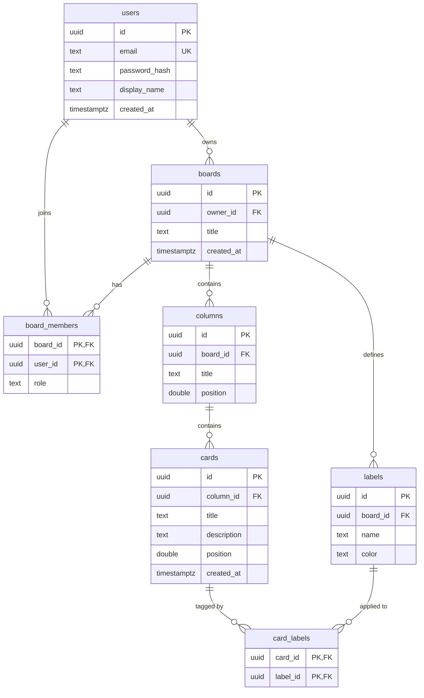

## What we're building

ก่อนจะเขียน SQL สักบรรทัด เราออกแบบรูปร่างของข้อมูลก่อน TaskFlow เป็นบอร์ด Kanban แบบเรียลไทม์ ดังนั้น data model จึงต้องเก็บทั้งผู้ใช้ (users), บอร์ดที่พวกเขาเป็นเจ้าของ, ใครบ้างที่มองเห็นแต่ละบอร์ด, คอลัมน์บนบอร์ด, การ์ดภายในคอลัมน์เหล่านั้น และ label ที่ใช้ติดแท็กให้การ์ด

รวมทั้งหมดเป็นเจ็ดตาราง นี่คือภาพรวมของทั้งโมเดล:

ไดอะแกรมนี้คือแหล่งข้อมูลหลัก (single source of truth) สำหรับคอร์สที่เหลือทั้งหมด ทุกโมดูลต่อจากนี้ — migrations, REST API, authentication, ชั้นเรียลไทม์ และ frontend — ล้วนอ้างอิงกลับมาที่ตารางและคอลัมน์ชุดนี้แบบเป๊ะ ๆ ถ้าออกแบบตรงนี้ให้ถูก ส่วนที่เหลือของโปรเจกต์ก็จะมีพื้นฐานที่มั่นคง

## Why

schema คือชุดของคำสัญญา มันบอกว่า *เอนทิตีเหล่านี้มีอยู่จริง แต่ละตัวถือฟิลด์อะไรบ้าง และมีกฎอะไรที่คอยรักษาให้ข้อมูลถูกต้อง* schema ที่ดีจะผลักการรับประกันความถูกต้องให้ลงไปอยู่ในฐานข้อมูลให้มากที่สุด ซึ่งเป็นที่ที่กฎเหล่านั้นมีผลเสมอ ไม่ว่าโค้ดส่วนไหนจะเป็นคนเขียนข้อมูลลงไป

โมเดลของ TaskFlow เป็นลำดับชั้น (hierarchy) แบบคลาสสิก บวกกับตาราง join แบบ many-to-many สองตาราง:

- **user** เป็นเจ้าของ **boards** หลายบอร์ด (one-to-many)
- **board** มี **members** หลายคนผ่านตาราง join `board_members` (many-to-many ระหว่าง users กับ boards)
- **board** มี **columns** หลายคอลัมน์ และ **column** มี **cards** หลายการ์ด — นี่คือแกนลำดับชั้นของ Kanban
- **board** นิยาม **labels** ได้หลายอัน และ **card** ติด label ได้หลายอันผ่านตาราง join `card_labels` (many-to-many ระหว่าง cards กับ labels)

มีการตัดสินใจสองอย่างที่ตัดผ่านทุกตาราง: เราใช้ **UUID primary key** แทนเลขจำนวนเต็มที่เพิ่มอัตโนมัติ และเราพึ่งพา **foreign key พร้อม `ON DELETE CASCADE`** เพื่อให้การลบแถวแม่ลบทุกอย่างที่ห้อยอยู่ใต้มันออกไปอย่างสะอาด ทั้งสองเรื่องอธิบายเต็ม ๆ ด้านล่าง

## Pros & cons

**UUID primary key (สิ่งที่เราใช้)**

- ข้อดี: ไม่ซ้ำกันทั่วโลก ทำให้สร้าง ID ได้ทั้งฝั่ง client, ใน API หรือในฐานข้อมูลโดยไม่ต้องประสานงานกัน; ไม่มีการชนกันข้ามตาราง; ไม่รั่วข้อมูลเชิงธุรกิจ (ค่า `id` ที่เป็นเลข `4207` แอบบอกโลกว่าคุณมีกี่แถว และให้ใครก็ตามเดา `/boards/4208` ได้); การรวมข้อมูลจากหลายแหล่งหรือทำ sharding ในภายหลังทำได้ง่ายเพราะ ID ไม่มีวันชนกัน
- ข้อเสีย: ใช้ 16 ไบต์แทนที่จะเป็น 4 หรือ 8 ทำให้ index ใหญ่ขึ้น; UUID แบบสุ่มกระจาย insert ไปทั่ว B-tree แทนที่จะต่อท้าย ซึ่งอาจทำให้ write locality แย่ลง; และมันอ่านหรือพิมพ์ยากตอน debug

**`bigserial` / เลขจำนวนเต็มเพิ่มอัตโนมัติ (ทางเลือก)**

- ข้อดี: กะทัดรัด (8 ไบต์), เพิ่มขึ้นต่อเนื่องจึง insert แบบต่อท้าย index (write locality ดีเยี่ยม), และดูด้วยตาง่าย
- ข้อเสีย: ค่าถูกเดาและไล่ลำดับได้ (ความเสี่ยง information-disclosure และ IDOR บน public API), ต้องมี round-trip หรือ sequence เพื่อสร้างค่า, และมันชนกันทันทีที่คุณพยายามรวมสองฐานข้อมูลหรือทำ sharding

สำหรับแอปที่ทำงานร่วมกันแบบเรียลไทม์ ซึ่ง client มักอยากสร้างการ์ดและรู้ ID ทันที — ก่อนที่ round-trip ไปเซิร์ฟเวอร์จะเสร็จ — UUID เหมาะกว่า เรายอมรับ index ที่ใหญ่ขึ้นเล็กน้อยเพื่อแลกกับอิสระในการทำงาน

**Foreign key พร้อม `ON DELETE CASCADE`**

- ข้อดี: ฐานข้อมูลบังคับ referential integrity — คุณ insert การ์ดที่ชี้ไปยังคอลัมน์ที่ไม่มีอยู่จริงไม่ได้เลย — และ cascade delete ช่วยรักษาข้อมูลให้เรียบร้อยโดยไม่ต้องมีคิวรีล้างข้อมูลแบบมือกองพะเนิน
- ข้อเสีย: cascade อาจลบมากกว่าที่คุณคาดถ้าไม่ระวัง (ลบบอร์ดเดียวล้างคอลัมน์ การ์ด และ label ทั้งหมดของมัน), และการตรวจ foreign key เพิ่มต้นทุนเล็กน้อยตอนเขียนข้อมูล ข้อแลกเปลี่ยนเหล่านั้นคือสิ่งที่เราต้องการพอดี: บอร์ดที่ถูกลบ *ควร* พาสิ่งที่อยู่ในนั้นไปด้วย

## Build it

การ "สร้าง" schema ในขั้นนี้หมายถึงการออกแบบมันอย่างแม่นยำ — ปักหมุดจุดประสงค์ของทุกตารางและทุกคอลัมน์ บทเรียนถัดไปจะเปลี่ยนดีไซน์นี้เป็นไฟล์ migration จริง นี่คือแต่ละตาราง อธิบายทีละคอลัมน์

### `users`

ตารางบัญชีผู้ใช้ หนึ่งแถวต่อหนึ่งคนที่ล็อกอินได้

- `id uuid` — primary key ค่าเริ่มต้นเป็น `gen_random_uuid()`
- `email text` — ตัวระบุสำหรับล็อกอิน; `unique` และ `not null` เพื่อไม่ให้สองบัญชีใช้อีเมลเดียวกัน
- `password_hash text` — ค่าแฮช Argon2/bcrypt ของรหัสผ่าน ไม่เคยเก็บ plaintext จะถูกกำหนดในโมดูล Authentication
- `display_name text` — ชื่อที่อ่านได้ ที่แสดงบนการ์ดและรายชื่อสมาชิก
- `created_at timestamptz` — เวลาที่สร้างบัญชี ค่าเริ่มต้นเป็น `now()`

### `boards`

บอร์ด Kanban จุดสูงสุดของลำดับชั้นเนื้อหา

- `id uuid` — primary key
- `owner_id uuid` — foreign key ไปยัง `users(id)` พร้อม `on delete cascade`; ผู้ใช้ที่สร้างบอร์ด ลบผู้ใช้แล้วบอร์ดที่เขาเป็นเจ้าของก็หายไปด้วย
- `title text` — ชื่อบอร์ด
- `created_at timestamptz` — เวลาสร้าง ค่าเริ่มต้นเป็น `now()`

### `board_members`

ตาราง join แบบ many-to-many ระหว่าง users กับ boards — ใครได้รับอนุญาตให้ดูและแก้ไขบอร์ด นี่คือสิ่งที่โมดูล Authentication และ REST ตรวจในทุก request

- `board_id uuid` — foreign key ไปยัง `boards(id)`, `on delete cascade`
- `user_id uuid` — foreign key ไปยัง `users(id)`, `on delete cascade`
- `role text` — บทบาทของสมาชิกบนบอร์ดนี้ (`'member'` โดยค่าเริ่มต้น; คุณอาจเพิ่ม `'admin'` ในภายหลัง), `not null`
- **Primary key** เป็นแบบ composite `(board_id, user_id)` ซึ่งรับประกันว่าผู้ใช้หนึ่งคนปรากฏได้มากสุดหนึ่งครั้งต่อบอร์ด

### `columns`

เลนแนวตั้งบนบอร์ด — "To Do", "In Progress", "Done"

- `id uuid` — primary key
- `board_id uuid` — foreign key ไปยัง `boards(id)`, `on delete cascade`
- `title text` — หัวข้อคอลัมน์
- `position double precision` — คีย์การจัดเรียงที่ตัดสินลำดับคอลัมน์จากซ้ายไปขวา กลยุทธ์การจัดเรียงแบบเศษส่วนเป็นหัวข้อทั้งหมดของบทเรียน [indexes & ordering](/taskflow/th/database/indexes-ordering/)

### `cards`

การ์ดงานที่อยู่ภายในคอลัมน์ หน่วยที่ผู้ใช้ลากไปมา

- `id uuid` — primary key
- `column_id uuid` — foreign key ไปยัง `columns(id)`, `on delete cascade`
- `title text` — ชื่อการ์ด
- `description text` — เนื้อหายาวเสริม (nullable — การ์ดมีอยู่ได้ด้วยแค่ชื่อ)
- `position double precision` — คีย์การจัดเรียงสำหรับลำดับบนลงล่างภายในคอลัมน์
- `created_at timestamptz` — เวลาสร้าง ค่าเริ่มต้นเป็น `now()`

### `labels`

แท็กสีที่นิยามบนบอร์ดและใช้ซ้ำได้ข้ามการ์ดของบอร์ดนั้น

- `id uuid` — primary key
- `board_id uuid` — foreign key ไปยัง `boards(id)`, `on delete cascade` label สังกัดบอร์ด ไม่ใช่ระดับ global
- `name text` — ข้อความของ label ("Bug", "Urgent")
- `color text` — ค่าสี โดยทั่วไปเป็น hex string เช่น `#e11d48`

### `card_labels`

ตาราง join แบบ many-to-many ระหว่าง cards กับ labels — label ไหนถูกติดบนการ์ดไหน

- `card_id uuid` — foreign key ไปยัง `cards(id)`, `on delete cascade`
- `label_id uuid` — foreign key ไปยัง `labels(id)`, `on delete cascade`
- **Primary key** เป็นแบบ composite `(card_id, label_id)` เพื่อไม่ให้ label เดียวกันถูกติดบนการ์ดเดียวกันสองครั้ง

### สายโซ่ cascade

สังเกตว่า foreign key ประกอบกันเป็นสายโซ่: `users → boards → columns → cards` บวกกิ่งข้าง `boards → labels` และตาราง join สองตาราง เพราะ foreign key ทุกเส้นใช้ `on delete cascade` การลบบอร์ดเดียวจึงกวาดล้างอย่างสะอาด:

- `columns` ของมันถูกลบ ซึ่งจะลบ `cards` ของมันต่อ ซึ่งจะลบแถว `card_labels` ที่ตรงกันต่อ
- `labels` ของมันถูกลบ ซึ่งเคลียร์แถว `card_labels` ของมันเช่นกัน
- แถว `board_members` ของมันถูกลบ

`DELETE FROM boards WHERE id = ...` ครั้งเดียวไม่ทิ้งแถวกำพร้าไว้ที่ใดเลย นั่นคือผลตอบแทนของการบังคับความสัมพันธ์ในฐานข้อมูลแทนที่จะหวังว่าแอปพลิเคชันจะจำล้างข้อมูลเอง

## Verify

ยังไม่มีโค้ดให้รันตอนนี้ — นี่คือบทเรียนการออกแบบ — แต่คุณตรวจสอบความสมเหตุสมผลของโมเดลกับคำถามเหล่านี้ได้ก่อนไปต่อ:

- การ์ดชี้ไปยังคอลัมน์ที่ไม่มีอยู่ได้ไหม? ไม่ได้ — foreign key `column_id` ห้ามไว้
- ผู้ใช้คนเดียวถูกเพิ่มเข้าบอร์ดเดียวสองครั้งได้ไหม? ไม่ได้ — composite primary key `(board_id, user_id)` กันไว้
- ถ้าผู้ใช้ลบบัญชีตัวเอง บอร์ดที่เขาเป็นเจ้าของจะเป็นอย่างไร? มัน cascade-delete พาคอลัมน์ การ์ด label และการเป็นสมาชิกไปด้วย
- ตำแหน่งของการ์ดในคอลัมน์มาจากไหน? จากคอลัมน์ `position double precision` ซึ่งอธิบายในบทเรียนเรื่องการจัดเรียง

ถ้าคำตอบทั้งสี่ตรงกับไดอะแกรมด้านบน แสดงว่าดีไซน์แน่นหนาและพร้อมกลายเป็น migration

## Recap

คุณออกแบบ data model ของ TaskFlow ครบทั้งหมด: เจ็ดตาราง — `users`, `boards`, `board_members`, `columns`, `cards`, `labels`, `card_labels` — พร้อมลำดับชั้นความเป็นเจ้าของที่ชัดเจนและตาราง join แบบ many-to-many สองตาราง คุณได้เห็นว่าทำไม UUID primary key จึงเหนือกว่าเลขจำนวนเต็มเพิ่มอัตโนมัติสำหรับแอปเรียลไทม์ที่ขับเคลื่อนด้วย client, foreign key บังคับ referential integrity อย่างไร และ `ON DELETE CASCADE` ให้การลบบอร์ดเดียวลบทุกอย่างใต้มันได้อย่างสะอาดอย่างไร ต่อไป เราจะเปลี่ยนดีไซน์นี้เป็น migration จริงที่มีเวอร์ชันด้วย [`sqlx-cli`](/taskflow/th/database/migrations/)
