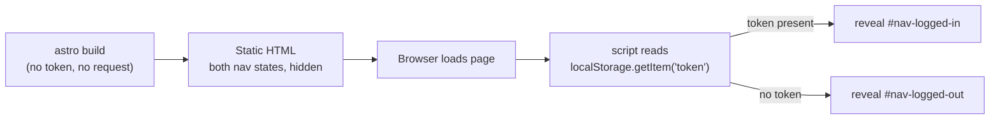

## What we're building

`Base.astro` ใต้ `frontend/src/layouts/` — layout ที่ทุกหน้าในโมดูลนี้ห่อตัวเองด้วย มันคือ HTML shell (`<html>`, `<head>`, `<body>`), `<slot />` สำหรับเนื้อหาของแต่ละหน้า, nav bar ที่มีสองสถานะ — "Log in" / "Register" ตอนที่ยังไม่มี token เก็บอยู่ กับ "Boards" / "Log out" ตอนที่มี — และ `frontend/src/styles/global.css` สไตล์ชีตแบบ global เล็ก ๆ ที่ import เข้ามาครั้งเดียวในบทนี้

`frontend/astro.config.mjs` มี integration ของ `@astrojs/preact` ต่อไว้แล้วตั้งแต่ Module 1 แต่บทนี้ไม่ได้แตะ Preact เลย — `Base.astro` และทุกหน้าที่มันห่อในโมดูลนี้ เป็น Astro ธรรมดาบวก `<script>` แบบ inline หนึ่งตัว บอร์ด Kanban แบบ reactive ที่ลาก-วางได้เป็นปัญหาคนละแบบจริง ๆ และมันต้องใช้เครื่องมือคนละแบบจริง ๆ ด้วย: Module 9, The Kanban Island

## Why

frontend ของ TaskFlow เป็น static site (`output: 'static'` ใน `astro.config.mjs`) — ไม่มี server render หน้าต่อ request ที่จะเช็คได้ว่า "ผู้เข้าชมคนนี้มี token ไหม" แล้วเลือก nav bar ให้เหมาะสม token อยู่ใน `localStorage` ของ browser ซึ่ง server ที่ build static HTML ไม่มีทางเห็นเลย ดังนั้น `Base.astro` จึง render nav ทั้งสองสถานะลงใน HTML พร้อมกัน ซ่อนไว้เป็นค่าเริ่มต้น แล้วให้ `<script>` ฝั่ง client เล็ก ๆ ตัดสินใจว่าจะเปิดตัวไหนทันทีที่หน้าโหลดเสร็จ:



นี่ไม่ใช่ hydration mismatch แบบที่เจอใน React/Preact — ไม่มี framework มา re-render component tree ฝั่ง client ที่ต้องตรงกับสิ่งที่ server สร้างไว้ มันคือ HTML ธรรมดาที่มี attribute `hidden` กับ script ที่เอา attribute นั้นออก เลยไม่มีอะไรให้ "mismatch" กันตั้งแต่ต้น

## Pros & cons

**Astro shell ธรรมดา + `<script>` แบบ inline หนึ่งตัว (ตัวที่เราใช้ ตั้งแต่บทนี้ถึง boards-list) เทียบกับการห่อทั้งหน้าด้วย island แบบ Preact/React ที่เป็น "app shell"**

- ข้อดี: หน้าที่ไม่ต้องการอะไรมากไปกว่า nav toggle, form หนึ่งอัน, กับ list ที่ render ออกมา ไม่ต้องส่ง framework runtime ไปเลยสักไบต์ — browser parse HTML ธรรมดากับ script เล็ก ๆ ที่ bundle มาหนึ่งตัว ไม่มีอะไรมากไปกว่านั้น การ render ครั้งแรกคือสิ่งที่ `astro build` สร้างไว้เป๊ะ ๆ ไม่มี JS bundle ให้ดาวน์โหลดและรันก่อนที่ฟอร์ม login หรือ list ของบอร์ดจะปรากฏ ไม่ต้องเลือก hydration directive ไม่มี component tree ไม่มี framework state — `document.getElementById` กับ event listener สองสามตัวคือต้นทุน runtime ทั้งหมด
- ข้อเสีย: nav toggle และทุกหน้าในโมดูลนี้ เขียน DOM update แบบ imperative เอง — `element.hidden = false`, `document.createElement('li')` — แทนที่จะเป็น state แบบ declarative (`{loggedIn ? <LoggedInNav /> : <LoggedOutNav />}`) นั่นก็โอเคสำหรับ nav bar สองสถานะ หรือ list ที่โตทีละหนึ่งรายการเท่านั้น (append-only แบบที่ boards-list สร้าง) แต่มันจะควบคุมยากขึ้นเร็วมากทันทีที่ UI ต้องติดตาม state หลายชิ้นที่ส่งผลถึงกันหมด ซึ่งตรงกับสิ่งที่บอร์ด Kanban จริง ๆ ต้องการเป๊ะ ๆ: การ์ดไหนกำลังถูกลาก กำลัง hover อยู่เหนือ column ไหน การจัดลำดับใหม่แบบ optimistic ที่ต้อง roll back ถ้า server ปฏิเสธ และ update จากที่อื่นที่มาทาง WebSocket ได้ทุกเมื่อ นั่นคือเส้นที่ Module 9 ข้ามไปด้วย Preact island ไม่มีอะไรในโมดูลนี้เข้าใกล้เส้นนั้นเลย

## Build it

### 1. `frontend/src/styles/global.css`

```css
:root {
  color-scheme: light dark;
  font-family: system-ui, sans-serif;
}

* {
  box-sizing: border-box;
}

body {
  margin: 0;
  min-height: 100vh;
  display: flex;
  flex-direction: column;
}

.site-header {
  display: flex;
  align-items: center;
  justify-content: space-between;
  padding: 1rem 1.5rem;
  border-bottom: 1px solid #33333322;
}

.brand {
  font-weight: 700;
  text-decoration: none;
  color: inherit;
}

.nav-group {
  display: flex;
  gap: 1rem;
  align-items: center;
}

.nav-group[hidden] {
  display: none;
}

main {
  flex: 1;
  padding: 1.5rem;
  max-width: 720px;
  margin: 0 auto;
  width: 100%;
}

button {
  font: inherit;
  cursor: pointer;
}
```

`.nav-group[hidden] { display: none; }` คือกฎที่ควรหยุดดูสักหน่อย: ถ้าไม่มีมัน `.nav-group { display: flex; }` ด้านบนจะชนะ cascade เหนือ `[hidden] { display: none; }` ที่เป็นค่าเริ่มต้นของ browser — ทั้งสองกฎมี specificity เท่ากัน (class selector หรือ attribute selector อย่างละหนึ่งตัว) และ author stylesheet ชนะ user-agent stylesheet เสมอเมื่อ specificity เท่ากัน compound selector อย่าง `.nav-group[hidden]` มี specificity สูงกว่า `.nav-group` เดี่ยว ๆ ดังนั้นมันจึงชนะแทน และ `hidden` ก็ซ่อน element ได้จริง

### 2. `frontend/src/layouts/Base.astro`

```astro
---
import '../styles/global.css';

export interface Props {
  title: string;
}

const { title } = Astro.props;
---
<html lang="en">
  <head>
    <meta charset="UTF-8" />
    <meta name="viewport" content="width=device-width, initial-scale=1.0" />
    <title>{title} · TaskFlow</title>
  </head>
  <body>
    <header class="site-header">
      <a class="brand" href="/">TaskFlow</a>
      <nav>
        <div id="nav-logged-out" class="nav-group" hidden>
          <a href="/login">Log in</a>
          <a href="/register">Register</a>
        </div>
        <div id="nav-logged-in" class="nav-group" hidden>
          <a href="/">Boards</a>
          <button id="logout-button" type="button">Log out</button>
        </div>
      </nav>
    </header>
    <main>
      <slot />
    </main>
  </body>
</html>

<script>
  const token = localStorage.getItem('token');
  const loggedOut = document.getElementById('nav-logged-out');
  const loggedIn = document.getElementById('nav-logged-in');

  if (token) {
    loggedIn?.removeAttribute('hidden');
  } else {
    loggedOut?.removeAttribute('hidden');
  }

  document.getElementById('logout-button')?.addEventListener('click', () => {
    localStorage.removeItem('token');
    window.location.href = '/login';
  });
</script>
```

`import '../styles/global.css';` ใน frontmatter ไม่ใช่ `<link rel="stylesheet">` ธรรมดาที่ชี้ไปยัง path ใต้ `/src/` — `src/styles/global.css` ไม่ได้ถูกเสิร์ฟตรง ๆ แบบไฟล์ใต้ `public/` มันต้องผ่าน asset pipeline ของ Vite การ `import` ไฟล์ `.css` ใน frontmatter ของ Astro ทำแบบนั้นเป๊ะ ๆ: Vite bundle มันแล้วแทรก `<link>` tag ที่ได้ให้อัตโนมัติ ไม่ต้องคอย sync path เองด้วยมือ

`localStorage.getItem('token')` ตรงนี้เป็นการเรียก browser API ตรง ๆ ไม่ใช่การเรียก `getToken()` — api-client อีกสองบทข้างหน้าคือที่ที่ `frontend/src/lib/api.ts` กับ helper แบบมี type อย่าง `getToken`/`setToken`/`clearToken` ถูกสร้างขึ้น script nav ของ `Base.astro` ต้องการแค่เช็คว่ามีหรือไม่มีเท่านั้น การใช้ API ดิบตรงนี้เลยหลีกเลี่ยง forward reference ไปยังไฟล์ที่บทนี้ยังไม่ได้สร้าง ส่วนหน้าที่ต้อง *เรียก* backend จริง ๆ (เริ่มจาก auth-pages บทถัดไป) จะใช้ helper แบบมี type แทน

`<script>` tag ไม่มี `src` และไม่มี attribute อื่นเลย — Astro ประมวลผล tag แบบนี้เป็นค่าเริ่มต้น: bundle ผ่าน Vite, type-check ด้วย TypeScript, และ deduplicate ถ้า layout เดียวกันถูกใช้หลายหน้าใน build เดียว นั่นคือสิ่งที่ทำให้การเขียนโค้ดสไตล์ `.ts` ตรง ๆ ใน `<script>` block ของไฟล์ `.astro` ใช้งานได้เลย โดยไม่ต้องตั้ง build step แยกต่างหาก

## Verify

```bash
cd frontend
npx astro check
```

คำสั่งนี้ type-check `Base.astro` — interface `Props`, การ destructure `Astro.props`, และ nav script — แต่ยังไม่ render อะไรออกมา เพราะยังไม่มีหน้าไหนใน project นี้ import `Base` จนกว่าจะถึงบทถัดไป พอ auth-pages สร้าง `login.astro` เสร็จ ให้รัน `npm run dev` เปิดหน้านั้น แล้วยืนยันว่า nav bar โชว์ "Log in / Register" จากนั้นเปิด console ของ devtools ใน browser รัน `localStorage.setItem('token', 'x')` แล้วรีโหลด — nav ควรสลับเป็น "Boards / Log out" โดยไม่ต้องแก้โค้ดส่วนอื่นเลย

## Recap

คุณสร้าง `Base.astro` — HTML shell ที่มี `<slot />`, nav bar สองสถานะที่ client script สลับตามว่า `localStorage` มี token หรือไม่ และสไตล์ชีตที่ import แบบ global คุณเห็นแล้วว่าทำไมการสลับต้องเกิดขึ้นฝั่ง client บน static site และทำไมหน้าต่าง ๆ ในโมดูลนี้ถึงยังเป็น Astro ธรรมดาบวก vanilla script แทนที่จะหยิบ Preact island มาใช้ — trade-off ที่ยังใช้ได้ดีจนกว่าจะถึงบอร์ด Kanban จริงของ Module 9 ที่ต้องการ client state ที่เชื่อมโยงกันจริง ๆ ต่อไป [auth-pages](/taskflow/th/frontend/auth-pages/) จะสร้าง `login.astro` กับ `register.astro` สองหน้าแรกที่ห่อตัวเองด้วย `Base` และเรียก backend เป็นครั้งแรก
