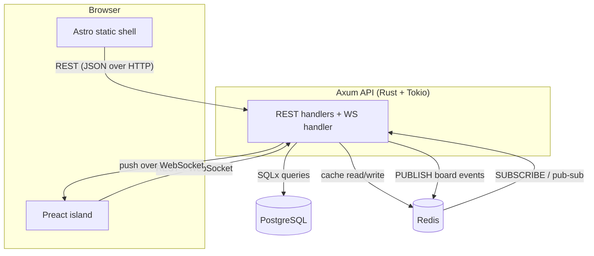

## สิ่งที่เราจะสร้าง

ก่อนจะเขียนโค้ดสักบรรทัด เรามาวาดภาพรวมทั้งระบบให้จบในหน้าเดียวกันก่อน TaskFlow มีชิ้นส่วนหลักสี่ตัว — frontend ที่อยู่บนเบราว์เซอร์, Axum API, PostgreSQL และ Redis — และมีเส้นทางสำคัญสองเส้นที่ไหลผ่านมัน คือ **เส้นทาง request** ทั่วไป (คุณขอข้อมูลหรือทำการเปลี่ยนแปลง) และ **เส้นทาง realtime** (การเปลี่ยนแปลงที่ใครทำก็ตามจะปรากฏแบบสด ๆ ให้ทุกคนเห็น)

นี่คือหน้าตาของมัน:

## ทำไมต้องทำแบบนี้

การแบ่งระบบแบบนี้ทำให้แต่ละหน้าที่อยู่ในเครื่องมือที่เก่งงานนั้นที่สุด: PostgreSQL ดูแลความจริงที่คงทน, Redis ดูแลความเร็วและการกระจายข้อมูล, Axum ดูแล business logic และ Astro ดูแล UI การเข้าใจสองเส้นทางด้านล่างคือโมเดลความคิดที่คุณจะพกติดตัวไปทุกโมดูลข้างหน้า

### เส้นทาง request

นี่คือ flow แบบคลาสสิก — อ่านบอร์ด, ย้าย card, สร้างคอลัมน์:

1. **เบราว์เซอร์** ส่ง HTTP request ไปยัง **Axum API** (เช่น `GET /boards/:id` หรือ `PATCH /cards/:id`) ทั้ง Preact island และ static shell คุยกับ REST endpoint ชุดเดียวกัน
2. Axum ยืนยันตัวตนของ request (JWT) แล้วรัน handler ของมัน
3. สำหรับการอ่าน มันจะเช็ค **Redis** ก่อนว่ามีสำเนา cache ไว้ไหม ถ้าเจอ (hit) ก็คืนค่ากลับทันที ถ้าไม่เจอ (miss) มันจะ query **PostgreSQL** ด้วย SQLx เก็บผลลัพธ์ไว้ใน Redis แล้วคืนค่า
4. สำหรับการเขียน มันจะอัปเดต **PostgreSQL** (แหล่งความจริง) ล้าง cache ของ Redis ที่เกี่ยวข้อง และที่สำคัญคือ **publish event** ไปยัง Redis เพื่อบอกว่ามีอะไรเปลี่ยนไป

### เส้นทาง realtime

นี่คือสิ่งที่ทำให้บอร์ดรู้สึกมีชีวิต:

1. เมื่อ client เปิดบอร์ด island ของมันจะเปิดการเชื่อมต่อ **WebSocket** ไปยัง Axum และเสมือนว่า "เข้าห้อง" ของบอร์ดนั้น
2. เมื่อมีการเขียนใด ๆ เกิดขึ้น (ข้อ 4 ด้านบน) Axum จะ **PUBLISH** event ไปยัง channel pub/sub ของ Redis สำหรับบอร์ดนั้น
3. ทุก instance ของ Axum จะ **SUBSCRIBE** channel เหล่านั้น Redis จะกระจาย event ออกไปให้ทุกตัว
4. แต่ละ instance ของ Axum จะ push event ลงไปตามทุก **WebSocket** ที่เปิดอยู่สำหรับบอร์ดนั้น
5. island ต่าง ๆ รับ event มาแล้วอัปเดต UI — card ก็จะเลื่อนข้ามคอลัมน์บนหน้าจอของเพื่อนร่วมทีมทุกคน

ทำไมต้องส่ง event ผ่าน Redis pub/sub แทนที่จะส่งตรงจาก handler ไปยัง WebSocket เลย? เพราะบน production คุณรัน Axum **มากกว่าหนึ่ง** instance อยู่หลัง load balancer card ที่ถูกย้ายบน instance A ต้องไปถึงเพื่อนร่วมทีมที่เชื่อมต่ออยู่กับ instance B ให้ได้ Redis pub/sub คือ **backplane** ที่เชื่อมพวกมันเข้าด้วยกัน และมันก็ทำงานได้ดีแม้มี instance เดียว เราจึงสร้างให้ถูกต้องตั้งแต่ต้น

## ข้อดีและข้อเสีย

สแตกของ TaskFlow คือชุดของการแลกเปลี่ยนที่ตั้งใจเลือก นี่คือมุมมองตรงไปตรงมาของแต่ละตัวเลือกหลัก

### Rust + Axum (เทียบกับ Node.js)

- **ข้อดี:** ความปลอดภัยตั้งแต่ตอน compile ดักจับบั๊กได้ทั้งกลุ่ม; ประสิทธิภาพยอดเยี่ยมและใช้หน่วยความจำน้อยแบบคาดเดาได้; concurrency ที่มั่นใจได้ผ่าน Tokio ทำให้การกระจาย event ผ่าน WebSocket ทนทาน; binary เดี่ยวแบบ static ทำ container ได้ง่ายมาก
- **ข้อเสีย:** เส้นทางการเรียนรู้ชันกว่าและเขียนช้ากว่า Node; ecosystem เล็กกว่าสำหรับไลบรารีเฉพาะทางบางตัว; เวลา compile นานกว่าลูป edit-refresh ของภาษาสคริปต์
- **ทำไมเราถึงเลือก:** เซิร์ฟเวอร์แบบ realtime ที่ต้องจัดการ connection พร้อมกันจำนวนมากคือจุดที่ความปลอดภัยและ concurrency ของ Rust เปล่งประกาย และเป็นภาษาที่คอร์ส Rust ของ Learn Hub เตรียมคุณไว้ให้

### PostgreSQL (เทียบกับ MongoDB)

- **ข้อดี:** ข้อมูลของ TaskFlow เป็นแบบ **relational** อย่างลึกซึ้ง — ผู้ใช้เป็นเจ้าของบอร์ด บอร์ดมีคอลัมน์ คอลัมน์มี card; foreign key และ transaction ช่วยรักษาความสอดคล้อง; การจัดลำดับ card เข้ากับ SQL อย่างเป็นธรรมชาติ; SQLx ให้ query ที่ตรวจสอบได้ตั้งแต่ตอน compile
- **ข้อเสีย:** คุณต้องออกแบบสคีมาไว้ล่วงหน้าและเขียน migration; ยืดหยุ่นต่อการเปลี่ยนรูปร่างข้อมูลน้อยกว่า document store
- **ทำไมเราถึงเลือก:** ความสัมพันธ์นี่แหละคือตัวโปรดักต์ document database จะผลักภาระความถูกต้องนั้นเข้าไปในโค้ดแอปพลิเคชันที่เราไม่อยากดูแล

### Redis — สามบทบาทของมันในที่นี้

Redis ทำหน้าที่ถึงสามอย่างใน TaskFlow ซึ่งเป็นเหตุผลว่าทำไมมันถึงคุ้มค่าที่จะมี:

1. **ที่เก็บ session / token** — refresh token ของ JWT และ state ของ session อยู่ที่นี่ เราจึงเพิกถอนมันได้ และคง auth ให้ไร้ state แต่ยังเพิกถอนได้
2. **read cache** — การอ่านบอร์ดที่ร้อนแรงถูกเสิร์ฟจาก Redis เพื่อไม่ให้ PostgreSQL ต้องทำ query เดิมซ้ำ ๆ
3. **pub/sub backplane** — event แบบ realtime ที่กระจายไปยังทุก WebSocket ตามที่อธิบายไว้ข้างต้น

- **ข้อดี:** dependency เดียวครอบคลุมสามความต้องการ; เร็วสุด ๆ; pub/sub เรียบง่ายและผ่านการพิสูจน์มาแล้ว
- **ข้อเสีย:** เพราะอยู่ในหน่วยความจำ ข้อมูล cache/session จึงหายได้หากไม่ตั้งค่าให้เก็บถาวร; และเป็นอีกหนึ่งเซอร์วิสที่ต้องรันและทำความเข้าใจ
- **ทำไมเราถึงเลือก:** แต่ละบทบาทในสามอย่างนี้ก็อาจเป็นเหตุผลให้ใช้ Redis ได้อยู่แล้ว เมื่อรวมกันมันจึงกลายเป็นกระดูกสันหลังของประสบการณ์ที่เร็วและสด

### Astro islands (เทียบกับ SPA เต็มรูปแบบ)

- **ข้อดี:** หน้าบอร์ดถูกส่งออกไปเป็น HTML แบบ static เกือบทั้งหมด — first paint เร็ว, SEO ดี, payload JS เล็ก; **เฉพาะ** บอร์ด Kanban ส่วนที่อินเทอร์แอกทีฟเท่านั้นที่ hydrate เป็น Preact island เราจึงจ่ายค่า interactivity เฉพาะตรงที่ต้องการ
- **ข้อเสีย:** คุณต้องคิดในแง่ "อะไรคือ static และอะไรคือ island" ซึ่งเป็นโมเดลที่ต่างจาก SPA ที่เป็น JS ทั้งหมด; การแชร์ state ข้าม island หลาย ๆ ตัวอาจยุ่งยาก (เราจึงจงใจใช้แค่ตัวเดียว)
- **ทำไมเราถึงเลือก:** แอป Kanban คือพื้นผิวอินเทอร์แอกทีฟเล็ก ๆ ชิ้นเดียวบนหน้าที่ส่วนใหญ่เป็น static โมเดล island จึงเข้ากันได้อย่างลงตัวและทำให้ frontend เบา

### WebSocket (เทียบกับ SSE / polling)

- **ข้อดี:** ช่องทาง **สองทิศทาง** จริง latency ต่ำ; client ส่งได้และ server push ได้บน connection เดียว; เหมาะกับ "ทุกคนเห็นการย้ายทันที"
- **ข้อเสีย:** connection ที่มี state สเกลยากกว่า HTTP ธรรมดา (จึงต้องมี Redis backplane); ต้องจัดการการเชื่อมต่อใหม่และ connection ที่หลุด
- **ทำไมเราถึงเลือก:** polling สิ้นเปลือง request และเพิ่ม lag; SSE เป็นทิศทางเดียว (server→client เท่านั้น) บอร์ด Kanban ที่ client ทั้งส่งการย้ายและรับการย้ายต้องการช่องทาง full duplex — นั่นคือ WebSocket

## ตรวจสอบผล

ทดสอบความเข้าใจของคุณ:

- คุณไล่เส้นทางของ **การย้าย card** ตั้งแต่เบราว์เซอร์ไปจนถึงหน้าจอของเพื่อนร่วมทีม โดยเรียกชื่อทุก hop ได้ไหม?
- ทำไม event แบบ realtime ถึงต้องผ่าน Redis pub/sub แทนที่จะไปตรงจาก handler สู่ socket?
- ในสามบทบาทของ Redis คุณจะเสียบทบาทไหนไปก่อนถ้าตัดมันออก และอะไรจะพัง?

## สรุป

TaskFlow มีสี่ส่วน — เบราว์เซอร์, Axum API, PostgreSQL, Redis — ที่ต่อกันตามสองเส้นทาง **เส้นทาง request** อ่านและเขียนข้อมูล (โดยมี Redis cache อยู่หน้า PostgreSQL); **เส้นทาง realtime** publish ทุกการเปลี่ยนแปลงไปยัง Redis pub/sub ซึ่งกระจายมันไปยังทุก instance ของ Axum และลงไปตามทุก WebSocket ทุกตัวเลือกของสแตก — Rust/Axum, PostgreSQL, สามบทบาทของ Redis, Astro islands, WebSocket — คือการแลกเปลี่ยนที่ตั้งใจซึ่งตอนนี้คุณอธิบายได้แล้ว ต่อไปเราจะไปตั้งค่าเครื่องของคุณใน [prerequisites](/taskflow/th/introduction/prerequisites/)
