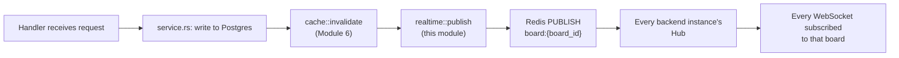

## What we're building

ยังไม่มีโค้ดในบทนี้ — บทนี้เป็นแผนที่สำหรับสามบทถัดไป เหมือนกับที่ [design](/taskflow/th/rest-api/design/) เคยทำหน้าที่นี้ให้กับโมดูล REST API เลเยอร์ realtime ของ TaskFlow มีหน้าที่เดียว: เมื่อการ์ดถูกย้าย คอลัมน์ถูกเปลี่ยนชื่อ หรือการ์ดถูกสร้าง/ลบ ทุกแท็บเบราว์เซอร์ที่เปิดบอร์ดนั้นอยู่ — ไม่ใช่แค่แท็บที่ทำการเปลี่ยนแปลง — ต้องเห็นสิ่งที่เกิดขึ้นทันที โดยไม่ต้องกด refresh

envelope เดียว ชื่อ `BoardEvent` แบกรับการอัปเดตทุกประเภท:

```rust
#[derive(serde::Serialize, serde::Deserialize)]
pub struct BoardEvent {
    pub r#type: String,
    #[serde(rename = "boardId")]
    pub board_id: Uuid,
    pub payload: serde_json::Value,
}
```

และรายการ `type` string ที่ตายตัวนี้ตั้งชื่อการเปลี่ยนแปลงทุกแบบที่โมดูลนี้กระจายออกไป:

| `type` | เกิดขึ้นเมื่อ | รูปแบบของ `payload` |
|---|---|---|
| `card.created` | สร้างการ์ดในคอลัมน์ | `{ "columnId": Uuid, "card": Card }` |
| `card.updated` | ชื่อ/รายละเอียดของการ์ดเปลี่ยน | `{ "card": Card }` |
| `card.moved` | การ์ดเปลี่ยนคอลัมน์และ/หรือตำแหน่ง | `{ "card": Card }` |
| `card.deleted` | การ์ดถูกลบ | `{ "cardId": Uuid, "columnId": Uuid }` |
| `column.created` | สร้างคอลัมน์บนบอร์ด | `{ "column": Column }` |
| `column.updated` | ชื่อคอลัมน์เปลี่ยน | `{ "column": Column }` |
| `column.deleted` | คอลัมน์ถูกลบ | `{ "columnId": Uuid }` |

`BoardEvent` ในฐานะ struct ของ Rust จะกลายเป็นโค้ดจริงใน [ws-endpoint](/taskflow/th/realtime/ws-endpoint/) — บทนี้กำหนดรูปร่างของมันไว้ครั้งเดียว เพื่อให้สามบทถัดไปสร้างต่อยอดได้โดยไม่ต้องนิยามซ้ำ

## Why

ทุก event ในรายการข้างบนตรงกับ mutation ที่มีอยู่แล้วจาก [REST API](/taskflow/th/rest-api/design/) พอดีหนึ่งรายการ — ฟังก์ชันประมาณสิบตัวเดียวกับที่ [invalidation](/taskflow/th/caching/invalidation/) เคยสอนให้เรียก `cache::invalidate` ทันทีหลังเขียนข้อมูลสำเร็จ realtime เพิ่มการเรียกอีกหนึ่งครั้ง อยู่ติดกันเป๊ะ ในฟังก์ชันเดิมชุดเดียวกัน:



`r#type` (ต้องใช้ raw identifier เพราะ `type` เป็นคีย์เวิร์ดของ Rust) และ `board_id` คือข้อมูลสำหรับ routing — บอกว่า event นี้เป็นของบอร์ดไหน และเกิดอะไรขึ้น ส่วน `payload` จงใจให้เป็น `serde_json::Value` แทนที่จะเป็น enum ที่มี type payload แยกแต่ละแบบ: payload ของแต่ละ event type มีรูปร่างต่างกันจริง ๆ (อาจเป็น `Card` เต็มตัว, `Column` เต็มตัว, หรือแค่ id เปล่า ๆ) และฝั่งไคลเอนต์ที่เป็น JavaScript ก็จะ `JSON.parse` envelope ทั้งก้อนแล้ว branch ตาม `type` อยู่ดี ไม่ว่าฝั่ง Rust จะไทป์ไว้แน่นแค่ไหน `Value` แบบทั่วไปในที่นี้ไม่มีต้นทุนเพิ่มฝั่ง Rust เลย (`serde_json::to_value` จัดการกับ type ที่เป็น `Serialize` ได้อย่างสม่ำเสมอ) และตรงกับสิ่งที่วิ่งผ่านสายจริง ๆ พอดี

เหตุผลที่เลือกโมเดล **broadcast-on-mutation** — เซิร์ฟเวอร์ push event ทันทีที่มีอะไรเปลี่ยน — แทนที่จะให้ไคลเอนต์ต้องถาม "มีอะไรเปลี่ยนไหม?" เป็นสิ่งแรกที่ควรตัดสินใจ ก่อนที่จะมีโค้ดใด ๆ มาถกเถียงเรื่องนี้ บทถัดไปจะสร้างกลไกจริง ส่วนบทนี้ตัดสินใจว่าทำไมกลไกนั้นถึงต้องเป็น WebSocket ที่ส่ง event จากเซิร์ฟเวอร์ไปไคลเอนต์ทางเดียว ไม่ใช่ polling loop

## Pros & cons

**WebSocket (สิ่งที่เราใช้) เทียบกับ Server-Sent Events (SSE) เทียบกับ long-polling**

- ข้อดี: WebSocket คือการเชื่อมต่อ TCP เดียวที่คงอยู่ต่อเนื่องและสื่อสารได้สองทาง — เซิร์ฟเวอร์ push event ได้ทันทีที่เกิดขึ้น ไม่ต้องมี polling interval ให้ปรับจูน และไม่มี overhead ของ HTTP ต่อข้อความ (header, การ reuse TLS handshake) เหมือนที่ request ใหม่แต่ละครั้งจะพกมาด้วย มันยังเป็นตัวเลือกที่เข้ากับฟีเจอร์ในอนาคตที่คอร์สนี้ไม่ได้สร้าง แต่เครื่องมือ Kanban จริงจังในที่สุดก็ต้องมี — การกระจายสถานะ cursor/presence ("Ada กำลังดูบอร์ดนี้อยู่") — ซึ่งต้องการให้ไคลเอนต์ส่งข้อความกลับได้ด้วย เป็นสิ่งที่ SSE ทำไม่ได้โดยพื้นฐาน (เป็น server-to-client ทางเดียวเท่านั้น) และ long-polling ก็ทำได้แค่จำลองโดยจับคู่กับ request ขาออกแยกต่างหาก
- ข้อเสีย: SSE (`text/event-stream` ผ่าน HTTP ธรรมดา) น่าจะง่ายกว่าสำหรับความต้องการปัจจุบันของ TaskFlow — มันคือ HTTP response ที่ไม่มีวันจบ ทำงานบนโครงสร้างเดียวกับ `fetch` ที่ใช้อยู่ทั่วไป reconnect อัตโนมัติด้วย `EventSource` โดยไม่ต้องเขียนโค้ดฝั่งไคลเอนต์เพิ่มเลย และไม่ต้องมี upgrade handshake หรือ `tokio::select!` loop แยกต่างหากฝั่งเซิร์ฟเวอร์ Long-polling (ไคลเอนต์ `GET` แล้วเซิร์ฟเวอร์ค้าง connection ไว้จนกว่าจะมีอะไรจะบอก หรือ timeout) เป็นตัวเลือกที่พึ่งพา infrastructure น้อยที่สุด — ไม่ต้องมี protocol พิเศษรองรับที่ไหนเลยตลอดเส้นทาง request — แต่มันปลอมให้ "push" ดูเหมือน "pull" ทำให้ overhead ต่อ event และ latency กลับมาอีกครั้ง ขึ้นอยู่กับว่า poll cycle หนึ่งรอบใช้เวลานานแค่ไหนกว่าจะรู้ตัว TaskFlow เลือก WebSocket เพราะมันตรงกับแนวคิดของ [WebSocket Design](https://en.wikipedia.org/wiki/WebSocket) ที่เนื้อหาข้างเคียงของคอร์สนี้อ้างอิงไว้ และเพราะมันเป็นตัวเลือกเดียวในสามแบบที่ไม่ปิดกั้นฟีเจอร์สองทางในอนาคต — ต้นทุนคือพิธีกรรมเพิ่มเติมที่โมดูลนี้ใช้เวลาสี่บทจัดการ: upgrade handshake, task ต่อ socket หนึ่งตัว และ (เริ่มจาก [redis-backplane](/taskflow/th/realtime/redis-backplane/)) วิธีกระจาย event เดียวออกไปยัง backend process มากกว่าหนึ่งตัว

**Broadcast-on-mutation (สิ่งที่เราใช้) เทียบกับการให้ไคลเอนต์ poll `GET /boards/:id` เป็นช่วง ๆ**

- ข้อดี: event มาถึงทันทีที่การเขียนที่เคลียร์ cache ของ [invalidation](/taskflow/th/caching/invalidation/) commit สำเร็จ — ไม่มีปุ่มปรับ "ควร poll บ่อยแค่ไหน" ให้ตั้งผิดพลาด (บ่อยเกินไปเปลืองรีเควสต์กับบอร์ดที่ไม่มีใครแก้ไข, ไม่บ่อยพอก็ได้ความ stale จริง ๆ) มันยังประกอบเข้ากับทุกอย่างที่สร้างไว้แล้วได้ลงตัว: `board_id` เดียวกับที่ [caching](/taskflow/th/caching/cache-reads/) ใช้เป็น namespace ของ cache key ก็เป็น `board_id` เดียวกับที่โมดูลนี้ใช้เป็นชื่อ pub/sub channel และเป็นฟิลด์ `BoardEvent.board_id` — identifier เดียว สามการใช้งานที่เกี่ยวข้องกันแต่แยกจากกัน ไม่มีวันสับสน เพราะแต่ละอย่างอยู่ใน namespace ที่ระบุไว้ชัดเจนของตัวเอง
- ข้อเสีย: broadcast-on-mutation บอกได้แค่ไคลเอนต์ที่เชื่อมต่ออยู่ว่ามีอะไรเปลี่ยน และสำหรับ event type ส่วนใหญ่ก็บอกด้วยว่าเปลี่ยนอะไรไปแบบเป๊ะ ๆ — แต่ไคลเอนต์ที่หลุดการเชื่อมต่อตอน event ยิงออกไปจะไม่มีวันได้รับมันเลย ไม่มี replay log ไม่มี "ช่วยอัปเดตข้อมูลย้อนหลังสิบนาทีที่แล้วให้หน่อย" [reconnect](/taskflow/th/realtime/reconnect/) จัดการช่องว่างนี้โดยตรง: ทางแก้ไม่ใช่ broadcast ที่ซับซ้อนขึ้นแบบ event-sourcing แต่เป็นการ refetch `GET /boards/:id` ธรรมดา ๆ ทันทีที่ socket reconnect โดยใช้ endpoint cache-aside ตัวเดิมที่ [caching](/taskflow/th/caching/cache-reads/) สร้างไว้แล้ว

## Verify

ยังไม่มีโค้ดให้รันในบทนี้ — ลองตรวจสอบความเข้าใจแทน:

- ฟิลด์ไหนใน `BoardEvent` ที่บอกไคลเอนต์ว่า event นี้เป็นของบอร์ดไหน และมันตรงกับชื่อ Redis pub/sub **channel** หรือชื่อ Redis cache **key** จาก [cache-reads](/taskflow/th/caching/cache-reads/)? (`board_id` ตรงกับชื่อ channel `board:{board_id}` — *ไม่ใช่* cache key `cache:board:{board_id}` ซึ่งเป็นคนละ namespace ของ Redis โดยสิ้นเชิง)
- ทำไม `payload` ถึงถูกกำหนดเป็น `serde_json::Value` แทนที่จะเป็น enum ของ Rust ที่มี variant หนึ่งต่อ event type หนึ่ง? (payload ของแต่ละ event type มีรูปร่างต่างกันจริง ๆ — `Card` เต็มตัว, `Column` เต็มตัว หรือแค่ id — และไคลเอนต์ก็ parse JSON แบบเดียวกันไม่ว่าจะเป็นแบบไหน `Value` แบบทั่วไปจึงตรงกับรูปแบบที่วิ่งผ่านสาย โดยไม่ต้องคิดค้น type ฝั่ง Rust ที่ไม่มีใครอ่านอยู่ปลายอีกด้านของ socket)
- ทำไม payload ของ `card.deleted` ถึงพก `columnId` มาด้วย ทั้งที่การ์ดตัวนั้น — และ `column_id` ของมัน — ไม่มีอยู่ใน Postgres แล้วตอนที่สร้าง event? (event ถูกสร้างจากแถวข้อมูล *ก่อน* ที่จะถูกลบ ในฟังก์ชัน service เดียวกันที่ดึงการ์ดขึ้นมาเพื่อตรวจสิทธิ์การลบอยู่แล้ว — ข้อมูลยังอยู่ในหน่วยความจำนานพอที่จะอธิบายสิ่งที่ถูกลบไป)

ถ้าสามคำตอบนี้เข้าใจได้ [ws-endpoint](/taskflow/th/realtime/ws-endpoint/) จะเริ่มเปลี่ยน envelope นี้ให้กลายเป็น route `GET /ws/boards/:id` ที่รันได้จริง

## Recap

คุณได้กำหนด `BoardEvent` — `type`, `boardId`, `payload` — และรายการ event เจ็ดรายการ ซึ่งเป็นรูปแบบข้อความเดียวที่ mutation ทุกตัวในโมดูลนี้จะกระจายออกไป คุณได้เปรียบเทียบ WebSocket กับ SSE และ long-polling แล้วเลือก WebSocket เพราะ latency ในการ push และช่องว่างสำหรับสื่อสารสองทางในอนาคต และเปรียบเทียบ broadcast-on-mutation กับการ polling ของไคลเอนต์ พร้อมชี้ช่องว่างจริงหนึ่งจุดที่ broadcast-on-mutation เปิดทิ้งไว้ — ไคลเอนต์ที่หลุดการเชื่อมต่อจะพลาด event ไปเลย — ซึ่ง [reconnect](/taskflow/th/realtime/reconnect/) จะปิดช่องว่างนี้ด้วยการ refetch ไม่ใช่ replay log ต่อไป [ws-endpoint](/taskflow/th/realtime/ws-endpoint/) จะสร้าง upgrade handler `/ws/boards/:id` ตัวจริงและ loop ต่อ socket ที่ส่ง event เหล่านี้
